# Requirements

### Overview & Goals
Erklärung und Behebung des Fehlers `'primaryData' not loaded for item (null/5/75574688)` in `TestLocalApi_CreateAndRetainItems` (`pkg/zotero/client/local_api_test.go`).

### Scope
- **In Scope:**
  - Technische Ursachenanalyse des Zotero-Desktop-Fehlers `'primaryData' not loaded for item (null/5/...)`.
  - Behebung von `TestLocalApi_CreateAndRetainItems` in `pkg/zotero/client/local_api_test.go`, sodass neue Items ohne vorherige Vergabe eines Client-Keys erstellt und servergenerierte Schlüssel (`CheckSuccess(0)`) für Abruf und Aktualisierung verwendet werden.
  - Sicherstellung, dass `UpdateItem` mit dem vollständigen, von Zotero zurückgelieferten Datenobjekt (`createdItem.Data`) arbeitet.
  - Verifikation sowohl gegen lokale Zotero-Instanzen als auch im Mock-Server-Testzyklus.
- **Out of Scope:**
  - Änderungen am Zotero-Desktop-Client selbst.

### User Stories
- **Als Entwickler** möchte ich `TestLocalApi_CreateAndRetainItems` erfolgreich gegen eine lokale Zotero-Desktop-Instanz ausführen können, ohne dass Zotero mit `'primaryData' not loaded for item` fehlschlägt.
- **Als Entwickler** möchte ich verstehen, warum die lokale Zotero-API bei der Item-Erstellung anders mit `Key` umgeht als die Zotero Cloud API.

### Functional Requirements
- `TestLocalApi_CreateAndRetainItems` übergibt bei der Item-Erstellung keinen vorab definierten Client-Key (`Key: ""`), wodurch die lokale Zotero-Instanz ein neues Item sauber anlegt und initialisiert.
- Der vom Server vergebene Item-Key wird über `createItemRes.CheckSuccess(0)` ermittelt.
- Aktualisierungen via `UpdateItem` nutzen das verifizierte `createdItem.Data` mit korrekt gesetzter `Version` und `Key`.

# Technical Design

### Ursachenanalyse: Warum tritt `'primaryData' not loaded for item (null/5/75574688)` auf?

1. **Unterschied zwischen Cloud API und Local Desktop API bei der Key-Vergabe**:
   - **Zotero Cloud API (`api.zotero.org`)**: Erlaubt es Clients, bei `POST /items` bereits einen eigenen, zufällig generierten 8-Zeichen-Key (`Key: "75574688"`) im Item-Payload mitzusenden. Der Cloud-Server verwendet diesen Key für das neue Item.
   - **Zotero Local API (`localhost:23119`)**: Der im Desktop-Client eingebettete Server nutzt intern die Zotero-JavaScript-/SQLite-Engine (`Zotero.Item`). 
     - Wenn ein Payload mit gesetztem `key` an `POST /items` gesendet wird, interpretiert der lokale Server dies als Referenz auf ein **bereits existierendes Item** und ruft `Zotero.Items.getByLibraryAndKey(libraryID, key)` auf.
     - Da das Item in der lokalen SQLite-Datenbank noch nicht existiert, liefert Zotero ein unvollständig initialisiertes `Item`-Objekt zurück (`this._primaryDataLoaded === false` und `this.libraryID === null`).
     - Beim Versuch, Felder zu setzen oder das Item zu speichern, wirft Zotero's Property-Getter die Exception:
       `'primaryData' not loaded for item (null/5/75574688)` (wobei `null` = LibraryID, `5` = ItemTypeID `book`, `75574688` = übergebener Key).

2. **Fehlerhafter Ablauf im Test `TestLocalApi_CreateAndRetainItems`**:
   - Der Test generierte vorab `itemKey := model.CreateKey()` und setzte `itemData.ItemDataBase.Key = itemKey`.
   - Beim Aufruf von `zot.CreateItems(...)` wurde dieser `Key` im JSON an den lokalen Server geschickt.
   - Zotero Desktop antwortete mit einem Fehlercode in `createItemRes.Failed["0"]` (`'primaryData' not loaded for item`).
   - `createItemRes.CheckSuccess(0)` scheiterte folglich mit dieser Fehlermeldung.

3. **Lösungsansatz**:
   - In `TestLocalApi_CreateAndRetainItems` wird `itemData.Key` bei der Neuerstellung leer gelassen (`Key: ""` bzw. nicht gesetzt).
   - Ein eindeutiger Identifier für den Titel (z. B. `titleKey := model.CreateKey()`) wird ausschließlich im Titelstring verwendet.
   - Zotero Desktop erstellt das Item als echtes neues Objekt (`new Zotero.Item('book')`), generiert den Key selbst und gibt ihn in `createItemRes.Success["0"]` zurück.
   - Der Test liest den Key via `actualItemKey, err := createItemRes.CheckSuccess(0)` aus und verwendet für den Update-Schritt `createdItem.Data.Title = updatedTitle` und `zot.UpdateItem(group.Id, &createdItem.Data, &lastModifiedVersion)`.

### Architecture Diagram

```mermaid
graph TD
    subgraph Problem: Mit gesetztem Key
        Client1[Client sendet POST mit key='75574688'] --> LocalServer1[Zotero Local Server]
        LocalServer1 --> Lookup[Versucht SQLite Lookup getByLibraryAndKey]
        Lookup --> Unloaded[Item nicht in DB -> _primaryDataLoaded=false, libraryID=null]
        Unloaded --> Error[Error: 'primaryData' not loaded for item]
    end

    subgraph Lösung: Ohne Key bei Neuerstellung
        Client2[Client sendet POST ohne key] --> LocalServer2[Zotero Local Server]
        LocalServer2 --> NewItem[Instanziiert new Zotero.Item: primaryData initialisiert]
        NewItem --> SaveOK[Item in SQLite gespeichert & Key generiert]
        SaveOK --> SuccessResp[HTTP 200: Success mit neuem Key]
    end
```

### Proposed Changes

1. **`pkg/zotero/client/local_api_test.go`**:
   - In `TestLocalApi_CreateAndRetainItems`:
     - `titleKey := model.CreateKey()` für eindeutige Titel verwenden.
     - `itemData.ItemDataBase.Key` bei der Initialisierung nicht belegen (`Key: ""`).
     - Nach erfolgreichem `CreateItems` den generierten Key via `actualItemKey, err := createItemRes.CheckSuccess(0)` abrufen.
     - Beim Update `createdItem.Data.Title = updatedTitle` setzen und `&createdItem.Data` an `UpdateItem` übergeben.

# Testing

### Validation Approach
- **Lokale Zotero API**:
  - `go test -v ./pkg/zotero/client -run "TestLocalApi_CreateAndRetainItems"` ausführen.
- **Mock Server Tests**:
  - `TestLocalApi_ItemCRUD_MockServerFullCycle` und `TestLocalApi_CollectionCRUD_MockServerFullCycle` ausführen.
- **Vollständige Test-Suite**:
  - `go test ./pkg/... ./cmd/...` ausführen, um sicherzustellen, dass keine Regressionen entstehen.

# Delivery Steps

### ✓ Step 1: Fix item creation key handling and update logic in `TestLocalApi_CreateAndRetainItems`
Update `TestLocalApi_CreateAndRetainItems` in `pkg/zotero/client/local_api_test.go` to avoid passing a pre-assigned `Key` when creating new items, extract the generated key via `createItemRes.CheckSuccess(0)`, and use `createdItem.Data` for the update step.

### ✓ Step 2: Run verification tests
Execute `go test` for `TestLocalApi_CreateAndRetainItems`, `TestLocalApi_ItemCRUD_MockServerFullCycle`, and the full test suite.