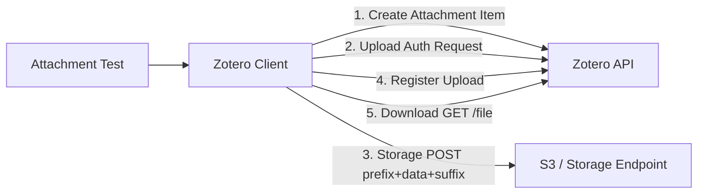

# Requirements

### Overview & Goals
Extend the test suite to test Zotero file attachments (`itemType == "attachment"`) including attachment item creation, the multi-step file upload protocol (`/items/{key}/file` upload authorization, storage upload, and registration), file downloads (`GET /items/{key}/file`), and data retention in the `APITEST` library across both Cloud API and mock environments.

### Scope
- **In Scope:**
  - Attachment item creation with `itemType: "attachment"`, `linkMode: "imported_file"`, `contentType`, `filename`, and optional `parentItem`.
  - Multi-step file upload testing:
    - Step 1: Upload authorization request via `POST /groups/{groupId}/items/{itemKey}/file` (`md5`, `filename`, `filesize`, `mtime`).
    - Step 2: Direct/S3 storage upload with `prefix` + binary payload + `suffix`.
    - Step 3: Upload registration via `POST /groups/{groupId}/items/{itemKey}/file` (`upload: uploadKey`).
  - File download testing via `DownloadAttachmentCloud()` (`GET /groups/{groupId}/items/{itemKey}/file`).
  - End-to-end mock server tests covering the complete attachment upload, download, and retry/rate-limiting flow.
  - Integration tests for live Cloud API (`TestCloudApi_CreateAndUploadAttachment`, `TestCloudApi_DownloadAttachment`) using a temporary `filesystem.LocalFs` store.
  - Retention verification update in `TestCloudApi_VerifyRetainedData` to inspect child attachment items.
  - Serialization unit tests for `ItemDataAttachment` and `ItemGeneric` attachment fields.
- **Out of Scope:**
  - Proprietary third-party storage backends (WebDAV / custom S3 sync scripts).

### User Stories
- As a developer, I want automated tests to verify that attachment items can be created, uploaded, and downloaded via the Zotero API, so that file synchronizations operate reliably.

### Functional Requirements
- Attachment items with `linkMode: "imported_file"` and associated binary files stored in `zot.Fs` must successfully execute `item.UpdateCloud()` and complete the 3-step upload protocol.
- `item.DownloadAttachmentCloud()` must retrieve the uploaded binary content, store it in `zot.Fs`, and return the expected MD5 digest.
- Mock server tests must validate upload authorization, prefix/suffix handling, registration, and binary download without external network dependencies.
- Cloud integration tests must verify parent-child relationship between a bibliographic item and its attachment in group `APITEST`.

# Technical Design

### Current Implementation
- `pkg/zotero/itemAttachment.go`: Defines `ItemDataAttachment` with `LinkMode`, `ContentType`, `Filename`, `MD5`, `MTime`, etc.
- `pkg/zotero/itemGeneric.go`: Contains attachment fields on `ItemGeneric` (`LinkMode`, `ContentType`, `Filename`, `MD5`, `MTime`).
- `pkg/zotero/item.go`:
  - `uploadFileCloud()`: Implements the 3-step upload protocol:
    1. `POST /groups/{groupId}/items/{itemKey}/file` with form params (`md5`, `filename`, `filesize`, `mtime`) -> receives `url`, `contentType`, `prefix`, `suffix`, `uploadKey` (or `exists`).
    2. `POST <url>` with `prefix + data + suffix` -> `201 Created`.
    3. `POST /groups/{groupId}/items/{itemKey}/file` with `upload=<uploadKey>` -> `204 No Content`.
  - `DownloadAttachmentCloud()`: Queries `GET /groups/{groupId}/items/{itemKey}/file`, stores data in `item.Group.Zot.Fs`, and returns MD5.
  - `UpdateCloud()`: Automatically triggers `uploadFileCloud()` when `item.Data.ItemType == "attachment" && item.Data.LinkMode == "imported_file"`.

### Key Decisions
- **Temporary LocalFs for Attachment File Storage in Tests:**
  - In integration tests, configure `Zotero.Fs` with a temporary directory (`t.TempDir()`) using `filesystem.NewLocalFs` so `uploadFileCloud()` and `DownloadAttachmentCloud()` can read and write actual binary files safely.
- **Comprehensive Mock Server Lifecycle:**
  - Create a mock HTTP server in `pkg/zotero/zotero_cloud_api_test.go` simulating upload authorization, mock storage endpoint (`/upload-mock`), registration, and file download to guarantee fast, deterministic regression testing.
- **Parent Item Attachment Workflow in Cloud Integration Tests:**
  - Create a parent book item first, then attach a child file attachment (`parentItem: parentKey`), verify upload, and verify download.

### Architecture Diagram

### File Structure
- `pkg/zotero/zotero_cloud_api_test.go`:
  - Add `TestCloudApi_AttachmentUploadAndDownload_MockServer`.
  - Add `TestCloudApi_CreateAndRetainAttachment`.
  - Update `TestCloudApi_VerifyRetainedData` to log and verify attachments.
- `pkg/zotero/zotero_test.go`:
  - Add `TestItemDataAttachmentSerialization`.

# Testing

### Validation Approach
- **Unit Tests:**
  - Validate JSON marshaling/unmarshaling of `ItemDataAttachment` and `ItemGeneric` for attachment items.
- **Mock Server Tests:**
  - Simulate the full upload authorization, payload framing, registration, and download cycle.
  - Test edge cases like `"exists": 1` (file already on server) and rate limiting (HTTP 429).
- **Live Integration Tests:**
  - Execute `TestCloudApi_CreateAndRetainAttachment` against the live `APITEST` library to confirm end-to-end compatibility.

### ✓ Step 1: Unit tests for attachment item serialization
- Add unit test `TestItemDataAttachmentSerialization` in `pkg/zotero/zotero_test.go` covering JSON marshaling and unmarshaling of attachment items (`ItemDataAttachment`, `ItemGeneric`) including fields `linkMode`, `contentType`, `filename`, `md5`, `mtime`, `parentItem`.

### ✓ Step 2: Mock server tests for attachment upload and download protocol
- Add `TestCloudApi_AttachmentUploadAndDownload_MockServer` in `pkg/zotero/zotero_cloud_api_test.go` simulating upload authorization (step 1), direct/S3 storage endpoint with prefix/suffix framing (step 2), registration (step 3), existing file case (`"exists": 1`), and file download via `DownloadAttachmentCloud()`.

### ✓ Step 3: Integration tests for attachment creation, upload, download, and retention
- In `pkg/zotero/zotero_cloud_api_test.go`, add `TestCloudApi_CreateAndRetainAttachment` (and update `TestCloudApi_VerifyRetainedData`) using temporary `filesystem.LocalFs` to test creating parent item, creating child attachment item, uploading file content, downloading file content, verifying MD5 and parent relationship against live Cloud API.

### ✓ Step 4: Execute test suite and verify all tests pass
- Run `go test -v -run TestItemDataAttachmentSerialization ./pkg/zotero/...`.
- Run `go test -v -run TestCloudApi_AttachmentUploadAndDownload_MockServer ./pkg/zotero/...`.
- Run `go test -v -run TestCloudApi_CreateAndRetainAttachment ./pkg/zotero/...`.
- Run `go test -v -run TestCloudApi_VerifyRetainedData ./pkg/zotero/...`.
- Run full test suite `go test -count=1 ./pkg/... ./info/...`.