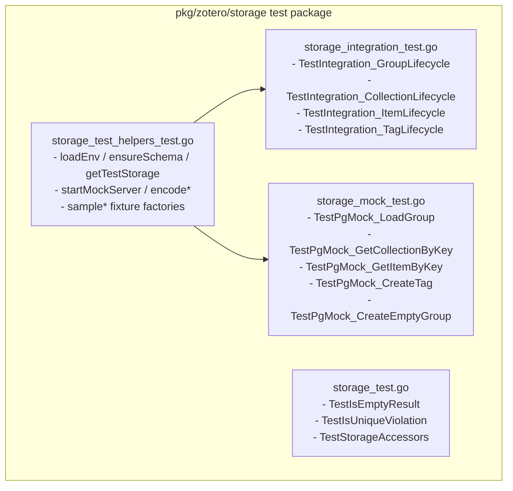

# Requirements

### Overview & Goals
Extract shared test code and helper utilities in `pkg/zotero/storage` into a dedicated test helper file `pkg/zotero/storage/storage_test_helpers_test.go`:
1. Centralize test infrastructure (environment loading `loadEnv`, schema migration DDL `ensureSchema`, live DB setup/teardown `getTestStorage`).
2. Centralize mock server lifecycle (`startMockServer`) and wire-protocol binary encoder utilities (`encodeInt8`, `encodeBool`, `encodeText`, `encodeTimestamp`).
3. Provide reusable test data factories/fixtures (`sampleGroupData`, `sampleCollectionData`, `sampleItemData`, `sampleTag`) shared by both integration and mock tests.
4. Clean up `storage_integration_test.go` and `storage_mock_test.go` so they contain only test scenario logic.

### Scope
- **In Scope**:
  - Creating `pkg/zotero/storage/storage_test_helpers_test.go` containing all shared test setup, mock utilities, and test data generators.
  - Refactoring `pkg/zotero/storage/storage_integration_test.go` to remove duplicated helper functions and utilize shared helpers.
  - Refactoring `pkg/zotero/storage/storage_mock_test.go` to remove duplicated server/encoder functions and utilize shared helpers.
  - Keeping `pkg/zotero/storage/storage_test.go` dedicated to fast offline unit tests.
  - Verifying all test suites (`go test -v ./pkg/zotero/storage/...` and `go test ./...`) and builds (`go build ./...`) succeed.
- **Out of Scope**:
  - Changing production storage APIs or SQL queries.
  - Modifying tests outside `pkg/zotero/storage`.

### User Stories
- **As a Developer**, I want shared test helper utilities, mock server setups, and test fixture factories in a dedicated file (`storage_test_helpers_test.go`) so that test files are clean, maintainable, DRY, and easy to read.

### Functional Requirements
- **FR-1**: `storage_test_helpers_test.go` must contain shared environment loading (`loadEnv`), DDL table/view creation (`ensureSchema`), and connection test runner (`getTestStorage`).
- **FR-2**: `storage_test_helpers_test.go` must contain mock server runner (`startMockServer`) and binary field encoders (`encodeInt8`, `encodeBool`, `encodeText`, `encodeTimestamp`).
- **FR-3**: `storage_test_helpers_test.go` must provide shared test fixtures / factories (`sampleGroupData`, `sampleCollectionData`, `sampleItemData`, `sampleTag`) for consistent test entity creation.
- **FR-4**: `storage_integration_test.go` must contain only `TestIntegration_*` lifecycle tests.
- **FR-5**: `storage_mock_test.go` must contain only `TestPgMock_*` mock tests.
- **FR-6**: `storage_test.go` must contain only unit tests (`TestIsEmptyResult`, `TestIsUniqueViolation`, `TestStorageAccessors`).

### Non-Functional Requirements
- **Maintainability & DRY**: Eliminate redundant helper logic across test files.
- **Build & Test Cleanliness**: All test suites in `pkg/zotero/storage` continue to pass without regression.

# Technical Design

### Current Implementation
- `pkg/zotero/storage/storage_integration_test.go` contains `loadEnv()`, `ensureSchema()`, `getTestStorage()`, and integration tests.
- `pkg/zotero/storage/storage_mock_test.go` contains `startMockServer()`, `encodeInt8()`, `encodeBool()`, `encodeText()`, `encodeTimestamp()`, and mock tests.
- Test entities (Group, Collection, Item, Tag models) are instantiated ad-hoc inside each test function.

### Key Decisions
- **Dedicated Helper File**: Place all shared test utilities in `pkg/zotero/storage/storage_test_helpers_test.go`. Since it belongs to package `storage` with the `_test.go` suffix, all symbols are directly accessible to all test files in the package during `go test`, while being excluded from production binaries.
- **Shared Test Data Factories**: Introduce helper functions to construct standard test entities (`sampleGroupData`, `sampleCollectionData`, `sampleItemData`, `sampleTag`), ensuring consistent data shapes between mock tests and live integration tests.

### Proposed File Structure
- `pkg/zotero/storage/storage_test_helpers_test.go` (NEW):
  - Environment & DB setup: `loadEnv()`, `ensureSchema(...)`, `getTestStorage(...)`
  - Mock server infrastructure: `startMockServer(...)`, `encodeInt8(...)`, `encodeBool(...)`, `encodeText(...)`, `encodeTimestamp(...)`
  - Test data fixtures: `sampleGroupData(...)`, `sampleCollectionData(...)`, `sampleItemData(...)`, `sampleTag(...)`
- `pkg/zotero/storage/storage_integration_test.go`:
  - Contains `TestIntegration_GroupLifecycle`, `TestIntegration_CollectionLifecycle`, `TestIntegration_ItemLifecycle`, `TestIntegration_TagLifecycle`.
- `pkg/zotero/storage/storage_mock_test.go`:
  - Contains `TestPgMock_*` test functions.
- `pkg/zotero/storage/storage_test.go`:
  - Contains `TestIsEmptyResult`, `TestIsUniqueViolation`, `TestStorageAccessors`.

### Architecture Diagram


# Testing

### Validation Approach
- Run all unit, mock, and integration tests in storage:
  ```powershell
  go test -v ./pkg/zotero/storage/...
  ```
- Run full workspace tests and verify compilation:
  ```powershell
  go test ./...
  go build ./...
  ```

# Delivery Steps

### ✓ Step 1: Create storage_test_helpers_test.go with shared test infrastructure and fixture factories
All shared test utilities, mock server setup, binary encoders, and sample data factories are centralized in `pkg/zotero/storage/storage_test_helpers_test.go`.

- Create `pkg/zotero/storage/storage_test_helpers_test.go` with `package storage`.
- Move `loadEnv`, `ensureSchema`, and `getTestStorage` (with graceful skip) into this file.
- Move `startMockServer`, `encodeInt8`, `encodeBool`, `encodeText`, and `encodeTimestamp` into this file.
- Add shared sample data factory functions (`sampleGroupData`, `sampleCollectionData`, `sampleItemData`, `sampleTag`) for consistent test entity generation.

### ✓ Step 2: Refactor storage_integration_test.go and storage_mock_test.go to use shared helpers
`storage_integration_test.go` and `storage_mock_test.go` are streamlined to focus solely on test execution logic.

- Remove extracted helper functions and encoders from `storage_integration_test.go` and `storage_mock_test.go`.
- Ensure all test cases invoke the shared helpers and fixtures seamlessly.
- Execute `go test -v ./pkg/zotero/storage/...` and workspace tests (`go test ./...`, `go build ./...`) to ensure 100% test pass.