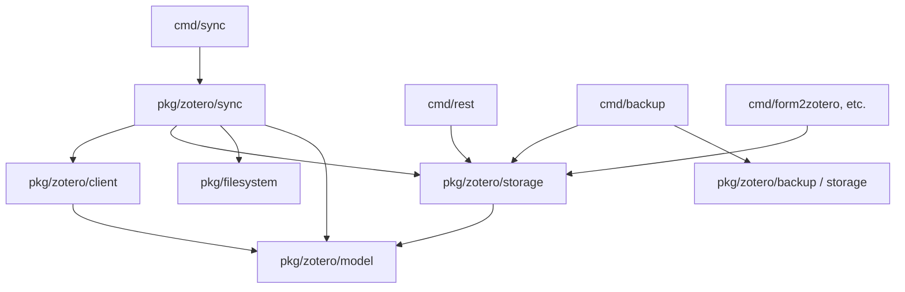

# Requirements

### Overview & Goals
Das Paket `pkg/zotero` vereint derzeit Datenstrukturen (Models), HTTP-Web-API-Kommunikation mit Zotero (Cloud und Local API), PostgreSQL-Datenbankzugriffe sowie die Synchronisations- und Backup-Logik in denselben Klassen und Methoden (`Zotero`, `Group`, `Collection`, `Item`). 

Ziel dieses Vorhabens ist eine saubere architektonische Entflechtung in kohärente Subpackages unter `pkg/zotero`:
- **`pkg/zotero/model`**: Reine Datenmodelle, JSON-Serialisierung und Hilfsfunktionen ohne externe I/O-Abhängigkeiten.
- **`pkg/zotero/client`**: Reiner HTTP-Client für die Zotero Web-API (Cloud/Local API, Rate Limiting, Backoff, CRUD).
- **`pkg/zotero/storage`**: Reines PostgreSQL-Repository für das lokale Caching und Verwalten von Zotero-Daten.
- **`pkg/zotero/sync`**: Synchronisations-Engine, die Client, Storage und FileSystem koordiniert.

### Scope
- **In Scope**:
  - Aufteilung des monolithischen `pkg/zotero` in die Subpackages `model`, `client`, `storage` und `sync`.
  - Entfernung zyklischer und gekoppelter Abhängigkeiten (z. B. direkte SQL-Aufrufe innerhalb von Modellen oder API-Methoden).
  - Vollständige Umstellung aller Konsumenten im Projekt (`cmd/sync`, `cmd/rest`, `cmd/backup`, `cmd/form2zotero`, `cmd/formlist`, `cmd/ikuvid2zotero`, `cmd/pcb2zotattach`, `cmd/vonarx2zotero`).
  - Anpassung und Ausführung aller vorhandenen Unit- und Integrationstests.
- **Out of Scope**:
  - Änderungen am Datenbank-Schema (`syncgroups`, `items`, `collections`, `tags`).
  - Änderungen am externen REST-API-Vertrag von `cmd/rest`.
  - Änderungen am Zotero-API-Protokoll oder Funktionsumfang.

### User Stories
- **Als Entwickler** möchte ich die Zotero Web-API ansprechen können, ohne eine SQL-Datenbank initialisieren oder konfigurieren zu müssen, um leichtgewichtige API-Clients und Tests bauen zu können.
- **Als Entwickler** möchte ich lokale Datenbankoperationen ausführen können (z. B. in `cmd/rest` oder `cmd/backup`), ohne zwingend einen HTTP-API-Key oder Netzwerkzugriff auf Zotero zu benötigen.
- **Als Entwickler** möchte ich Synchronisations- und Konfliktlogik isoliert testen und warten können, indem Client und Storage sauber getrennt übergeben werden.

# Technical Design

### Current Implementation
Im bestehenden `pkg/zotero` bündelt die `Zotero`-Struktur sowohl `*sql.DB` als auch `*resty.Client`. Die Domain-Objekte `Group`, `Collection` und `Item` halten Rückwärtszeiger (`Group.Zot *Zotero`, `Item.Group *Group`) und enthalten Methoden, die HTTP-Aufrufe (`*Cloud`), SQL-Abfragen (`*Local`), Synchronisationslogik (`Sync*`) und Filesystem-Backups (`Backup*`) direkt vermischen:
- `collection.go` / `group_collection.go`: `UpdateLocal()`, `DeleteCloud()`, `SyncCollections()`, `Backup()`
- `item.go` / `group_item.go`: `CreateItemLocal()`, `CreateItemsCloud()`, `UploadItems()`, `DownloadItems()`, `UploadAttachment()`, `Backup()`
- `group.go`: `LoadGroupLocal()`, `Sync()`, `BackupLocal()`, `ClearLocal()`

### Key Decisions
1. **Subpackage-Hierarchie unter `pkg/zotero`**:
   - `pkg/zotero/model`: Reine Go-Structs für Zotero-Typen (`Item`, `Collection`, `Group`, `Tag`, `User`, `ApiKey`), JSON-Tags und Enums (`SyncStatus`, `SyncDirection`).
   - `pkg/zotero/client`: Kapselt REST-Kommunikation (`resty.Client`), Header-Handling, Rate-Limiting/Backoff und CRUD-Methoden gegen Zotero Cloud/Local API.
   - `pkg/zotero/storage`: Kapselt `*sql.DB`, Schema-Handling und relationale CRUD-/Abfrageoperationen.
   - `pkg/zotero/sync`: Orchestrierungslogik für Up-/Download, Version-Check, Status-Reconciliation und Anbindung an `pkg/filesystem`.
2. **Entfernung von I/O-Handles aus Domain-Modellen**:
   - Models (`model.Item`, `model.Collection`, `model.Group`) sind passive Datenstrukturen ohne `*sql.DB`- oder `*resty.Client`-Felder.
3. **Direkte Vollmigration aller `cmd/*`**:
   - Bereinigung aller Altlasten in `cmd/sync`, `cmd/rest`, `cmd/backup` und den Konvertierungs-Tools (`cmd/form2zotero`, etc.) direkt auf die neuen Subpackages.

### Architecture Diagram

### Components & File Structure
- **`pkg/zotero/model/`**:
  - `item.go`, `collection.go`, `group.go`, `tag.go`, `user.go`, `apiKey.go`: Structs und JSON-Serialisierung.
  - `syncDirection.go`, `syncstatus.go`: Typen und Enums.
  - `helper.go`, `util.go`: `CreateKey`, `Text2Metadata`, `TextNoMeta`, `ExtractCollections`.
- **`pkg/zotero/client/`**:
  - `client.go`: `NewClient(...)`, `Init()`, Server-ID-Erkennung, Retry & Backoff (`CheckBackoff`, `CheckRetry`).
  - `group.go`, `collection.go`, `item.go`, `tag.go`, `delete.go`: Web-API Endpunkte.
- **`pkg/zotero/storage/`**:
  - `storage.go`: `NewStorage(...)`, SQL-Hilfen (`IsUniqueViolation`, `IsEmptyResult`).
  - `group.go`, `collection.go`, `item.go`, `tag.go`: SQL-Queries, Row-Scanner, Versionsabfragen.
- **`pkg/zotero/sync/`**:
  - `syncer.go`: `NewSyncer(...)`, `SyncGroup(...)`.
  - `sync_collection.go`, `sync_item.go`, `sync_tag.go`, `sync_delete.go`: Upload/Download-Abläufe und Statusverwaltung.
- **`cmd/*`**:
  - Imports und Initialisierungen werden auf `client`, `storage`, `sync` und `model` angepasst.

# Testing

### Validation Approach
Die Validierung erfolgt mehrstufig:
1. **Kompilierungs- und Typprüfung**: Sicherstellen, dass alle Pakete und `cmd/*`-Binaries fehlerfrei kompilieren.
2. **Unit-Tests der Modelle & Serialisierung**: Sicherstellen, dass JSON-Marshalling und Datenstrukturen unverändert arbeiten (`zotero_test.go`).
3. **Web-API Mock-Tests**: Verifikation des entkoppelten `client.Client` gegen lokale und Mock-HTTP-Endpunkte (`zotero_local_api_test.go`, `zotero_cloud_api_test.go`).
4. **Integrationstests**: Verifikation des Zusammenspiels von `client`, `storage` und `sync`.

### Key Scenarios
- **API-Client ohne DB**: `client.NewClient(...)` kann initialisiert werden, Server-ID erkennen und Cloud-Versionen abfragen, ohne dass eine Datenbankverbindung nötig ist.
- **Storage ohne API**: `storage.NewStorage(...)` kann Gruppen, Collections und Items laden und speichern, ohne dass ein API-Key konfiguriert ist.
- **Synchronisation**: `sync.NewSyncer(client, storage, fs, logger)` führt den synchronisierten Abgleich von Collections, Items, Tags und Deletions inklusive Version-Tracking korrekt durch.
- **CLI Tools**: `go build ./cmd/...` kompiliert alle CLI- und REST-Programme fehlerfrei.

# Delivery Steps

### ✓ Step 1: Modelle und Domänentypen extrahieren
Datenstrukturen und Serialisierungslogik sind vollständig von Web-API- und SQL-Abhängigkeiten entkoppelt.

- Erstellen des Pakets `pkg/zotero/model` (bzw. Bereinigen von `pkg/zotero`) für alle Entitäten: `Item`, `ItemGeneric`, `ItemMeta`, `ItemData*`, `Collection`, `CollectionData`, `Group`, `GroupData`, `Tag`, `User`, `ApiKey`, `SyncStatus`, `SyncDirection`, `ParentCollection` und `RelationList`.
- Bereinigen der Structs von eingebetteten `*sql.DB`- und `*resty.Client`-Referenzen (z. B. Entfernen des Felds `Zot *Zotero` aus `Group`, `Item`, `Collection`).
- Verschieben reiner Hilfsfunktionen (`CreateKey`, `Text2Metadata`, `TextNoMeta`, `ExtractCollections`, `EqualStringSlice`) in das Model-/Domain-Paket.
- Anpassen der bestehenden JSON-Marshalling-/Unmarshalling-Tests (`pkg/zotero/zotero_test.go`) an die bereinigten Modelle.

### ✓ Step 2: Zotero Web-API-Client implementieren
Ein eigenständiger HTTP-Client führt alle Zotero-Web-API-Operationen ohne Datenbankkopplung aus.

- Erstellen von `pkg/zotero/client` mit `Client`-Struct (kapselt `resty.Client`, Base-URL, API-Key, Server-ID, Logger).
- Portieren der Authentifizierungs-, Retry- und Backoff-Logik (`CheckBackoff`, `CheckRetry`, `DetectServerId`, `getCurrentKey`).
- Implementieren von API-Methoden für alle Zotero-Ressourcen:
  - User & Groups: `GetUserGroupVersions`, `GetGroups`, `GetGroup`
  - Collections: `GetCollections`, `GetCollectionVersions`, `GetCollectionByKey`, `CreateCollections`, `UpdateCollection`, `DeleteCollection`
  - Items: `GetItemsVersion`, `GetItemByKey`, `CreateItems`, `UpdateItem`, `DeleteItem`, `UploadAttachment`
  - Tags & Deletions: `GetTagsVersion`, `GetDeleted`
- Portieren und Ausführen der Unit- und Mock-API-Tests (`zotero_local_api_test.go`, `zotero_cloud_api_test.go`) gegen den neuen Client.

### ✓ Step 3: Datenbank-Storage-Repository implementieren
Ein dediziertes Storage-Repository kapselt alle PostgreSQL-Datenbankzugriffe und SQL-Abfragen.

- Erstellen von `pkg/zotero/storage` mit `Storage`-Struct (kapselt `*sql.DB`, `dbSchema`, Logger).
- Implementieren der CRUD- und Abfragemethoden für lokale Tabellen:
  - Gruppen: `LoadGroup`, `LoadGroups`, `CreateEmptyGroup`, `ClearGroup`
  - Collections: `GetCollections`, `GetCollectionByKey`, `GetCollectionVersions`, `CreateCollection`, `UpdateCollection`, `DeleteCollection`, `IterateCollections`
  - Items: `GetItems`, `GetItemByKey`, `GetItemsVersion`, `CreateItem`, `UpdateItem`, `DeleteItem`, `GetChildren`, `IterateItems`
  - Tags: `CreateTag`, `DeleteTag`
- Entfernen von gemischten Cloud-Aufrufen aus lokalen Speichermethoden.
- Bereitstellung von Schema- und Fehlerhilfen (`IsUniqueViolation`, `IsEmptyResult`).

### ✓ Step 4: Sync-Engine implementieren und alle cmd-Tools migrieren
Synchronisation und CLI-/REST-Tools sind auf die neue modulare Architektur umgestellt und voll funktionsfähig.

- Erstellen von `pkg/zotero/sync` mit `Syncer`-Orchestrator, der `client.Client`, `storage.Storage` und `filesystem.FileSystem` zusammenführt.
- Implementieren des Synchronisationsablaufs in `Syncer`: `SyncGroup`, `SyncCollections`, `UploadItems`, `DownloadItems`, `UploadAttachment`, `SyncTags`, `SyncDeleted`.
- Implementieren von Backup-Funktionen (`pkg/zotero/backup` oder im Storage-/Sync-Kontext) für das Schreiben von JSON-Dumps auf `filesystem.FileSystem`.
- Vollständige Migration aller `cmd/*`-Tools auf die neuen Subpackages:
  - `cmd/sync/main.go`
  - `cmd/rest/main.go` und alle `cmd/rest/handler*.go`
  - `cmd/backup/main.go`
  - `cmd/form2zotero`, `cmd/formlist`, `cmd/ikuvid2zotero`, `cmd/pcb2zotattach`, `cmd/vonarx2zotero`
- Bereinigen ungenutzter Altstrukturen und Durchführen von Tests und Build-Validierung über das gesamte Repository.