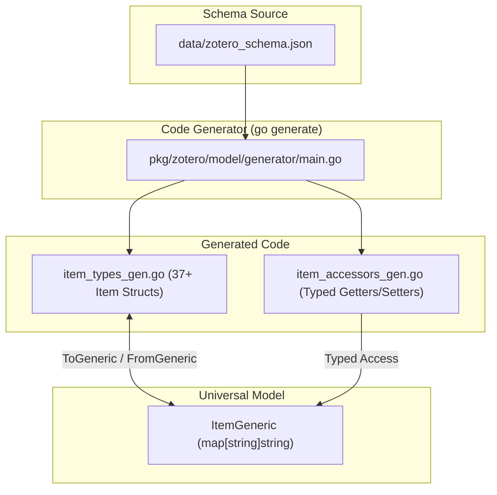

# Requirements

### Overview & Goals
The goal is to implement **Ansatz 2 (Type-Safe Code Generation via `go generate`)** for the Zotero data model. A code generation tool will parse `data/zotero_schema.json` to generate strongly-typed Go structs for all 37+ Zotero item types (e.g. `ItemBook`, `ItemJournalArticle`, `ItemFilm`, `ItemArtwork`, `ItemWebpage`, etc.) along with bidirectional converters to/from `ItemGeneric`, and typed getter/setter methods. In addition, `ItemGeneric.ExtraFields` will be transitioned from `map[string]any` to `map[string]string`, completely eliminating `any` and maximizing compile-time type safety while preserving 100% Zotero REST API JSON compatibility.

### Scope
- **In Scope:**
  - Creating a code generator in `pkg/zotero/model/generator` (or `cmd/generate-zotero-models`) executed via `//go:generate`.
  - Generating individual type-safe structs for all Zotero schema item types with exact field types, `ItemDataBase` embedding, and JSON tags.
  - Generating bidirectional conversion methods between concrete item types and `ItemGeneric` (`ToGeneric()`, `FromGeneric()`).
  - Generating typed getter and setter methods on `ItemGeneric` for all schema fields (`ISBN()`, `SetISBN()`, `DOI()`, `SetDOI()`, etc.).
  - Refactoring `ItemGeneric.ExtraFields` from `map[string]any` to `map[string]string` and updating `Get`/`Set` signatures to remove `any`.
  - Adding `go generate` directives and documenting generation workflows.
  - Adding unit tests for generated types, serialization roundtrips, and converters.
- **Out of Scope:**
  - Altering underlying database storage tables or schema.
  - Modifying external HTTP REST API contracts.

### User Stories
- **As a developer**, I want dedicated, strongly typed Go structs for every Zotero item type (e.g. `ItemBook`, `ItemFilm`) with IDE autocompletion and compile-time type checking so that typos in field names and invalid types are impossible at compile time.
- **As a developer**, I want to easily convert between concrete item structs and `ItemGeneric` for universal storage, client requests, and sync operations.
- **As a maintainer**, I want schema updates to be automated via `go generate ./...` so that changes in `zotero_schema.json` automatically update all Go structs and accessor methods without manual maintenance.

### Functional Requirements
1. **Model Generator**: Parse `data/zotero_schema.json` and generate `pkg/zotero/model/item_types_gen.go` and `pkg/zotero/model/item_accessors_gen.go` using standard Go formatting (`go/format`).
2. **Type-Safe Item Structs**: Generate 37+ dedicated structs (e.g. `ItemBook`, `ItemJournalArticle`, `ItemDocument`, `ItemFilm`) with `ItemDataBase` embedded and all valid schema fields as typed Go fields with proper `json:"field,omitempty"` tags.
3. **Bidirectional Conversion**: Each concrete type provides `.ToGeneric() *ItemGeneric` and `FromGeneric(gen *ItemGeneric) error` to seamlessly interoperate with generic handlers and client APIs.
4. **Strongly-Typed Universal ItemGeneric**: Refactor `ItemGeneric` so `ExtraFields` is `map[string]string` (since all dynamic Zotero fields are strings), removing all runtime `any` types.
5. **Typed Accessors**: Provide typed getters/setters on `ItemGeneric` for every schema field (e.g. `item.SetISBN("...")`, `item.ISBN()`).

### Non-Functional Requirements
- **Determinism**: Code generator produces deterministic, formatted Go code.
- **Zero Reflection Overhead**: Direct field access on concrete structs without runtime reflection.
- **Backwards Compatibility**: Existing `ItemGeneric` callers continue to work seamlessly.

# Technical Design

### Current Implementation
- `pkg/zotero/model/itemGeneric.go` uses `ExtraFields map[string]any` and `Get`/`Set` with `any`.
- Developers must use string literals like `item.SetString("runningTime", "120")` rather than typed fields or typed methods.
- No compile-time checks exist for specific item types (e.g. setting an `ISBN` on a `film` is only caught at runtime by `Validate()`).

### Key Decisions
1. **Generator Package in `pkg/zotero/model/generator`**:
   - *Decision*: Place the generator command under `pkg/zotero/model/generator/main.go` and invoke it via `//go:generate go run ./generator` in `pkg/zotero/model/schema.go`.
   - *Rationale*: Keeps generation tooling self-contained within the model module, enabling simple execution via `go generate ./...`.
2. **Concrete Struct Generation for all 37 Zotero Types**:
   - *Decision*: Generate structs named `Item<ItemTypeCamelCase>` (e.g., `ItemBook`, `ItemJournalArticle`, `ItemFilm`, `ItemBlogPost`, `ItemArtwork`, `ItemDocument`).
   - *Rationale*: Follows Go naming conventions in the project, embeds `ItemDataBase`, and provides direct struct fields with `json:"field,omitempty"`.
3. **Conversion Interface & Methods**:
   - *Decision*: Provide `ToGeneric() *ItemGeneric` and `FromGeneric(*ItemGeneric)` for each generated item type, and an `ItemData` interface implemented by all generated structs.
   - *Rationale*: Allows high-level client/sync APIs to accept both generic items and concrete typed structs.
4. **Eliminate `any` in `ItemGeneric`**:
   - *Decision*: Change `ExtraFields` to `map[string]string`. Update `Get(field string) (string, bool)` and `Set(field string, val string)`.
   - *Rationale*: In Zotero API v3, all non-base fields are strings. Removing `any` avoids type assertions and runtime overhead.

### Data Models & Contracts

#### Generated Concrete Structs (`item_types_gen.go`)
```go
package model

// Code generated by go generate; DO NOT EDIT.

type ItemBook struct {
	ItemDataBase
	Title           string `json:"title,omitempty"`
	AbstractNote    string `json:"abstractNote,omitempty"`
	Series          string `json:"series,omitempty"`
	SeriesNumber    string `json:"seriesNumber,omitempty"`
	Volume          string `json:"volume,omitempty"`
	NumberOfVolumes string `json:"numberOfVolumes,omitempty"`
	Edition         string `json:"edition,omitempty"`
	Place           string `json:"place,omitempty"`
	Publisher       string `json:"publisher,omitempty"`
	Date            string `json:"date,omitempty"`
	NumPages        string `json:"numPages,omitempty"`
	Language        string `json:"language,omitempty"`
	ISBN            string `json:"ISBN,omitempty"`
	ShortTitle      string `json:"shortTitle,omitempty"`
	Url             string `json:"url,omitempty"`
	AccessDate      string `json:"accessDate,omitempty"`
	Archive         string `json:"archive,omitempty"`
	ArchiveLocation string `json:"archiveLocation,omitempty"`
	LibraryCatalog  string `json:"libraryCatalog,omitempty"`
	CallNumber      string `json:"callNumber,omitempty"`
	Rights          string `json:"rights,omitempty"`
	Extra           string `json:"extra,omitempty"`
}

func (b *ItemBook) ToGeneric() *ItemGeneric { ... }
func (b *ItemBook) FromGeneric(g *ItemGeneric) error { ... }
```

#### Refactored `ItemGeneric` (`itemGeneric.go`)
```go
type ItemGeneric struct {
	ItemDataBase

	// Core common fields
	Title        string `json:"title,omitempty"`
	AbstractNote string `json:"abstractNote,omitempty"`
	Date         string `json:"date,omitempty"`
	Url          string `json:"url,omitempty"`
	Extra        string `json:"extra,omitempty"`
	ShortTitle   string `json:"shortTitle,omitempty"`

	// Attachment fields
	LinkMode    string `json:"linkMode,omitempty"`
	Note        string `json:"note,omitempty"`
	ContentType string `json:"contentType,omitempty"`
	Charset     string `json:"charset,omitempty"`
	Filename    string `json:"filename,omitempty"`
	MD5         string `json:"md5,omitempty"`
	MTime       int64  `json:"mtime,omitzero"`

	// Type-safe string map for all other schema fields
	ExtraFields map[string]string `json:"-"`
}

func (item *ItemGeneric) Get(field string) (string, bool)
func (item *ItemGeneric) Set(field, val string)
func (item *ItemGeneric) Delete(field string)
func (item *ItemGeneric) Validate() error
```

### Architecture Diagram



### File Structure
- `data/zotero_schema.json`: Schema definition.
- `pkg/zotero/model/generator/main.go`: Code generation script.
- `pkg/zotero/model/item_types_gen.go`: Generated concrete item structs.
- `pkg/zotero/model/item_accessors_gen.go`: Generated typed getters & setters on `ItemGeneric`.
- `pkg/zotero/model/itemGeneric.go`: Refactored `ItemGeneric` without `any`.
- `pkg/zotero/model/schema.go`: `//go:generate` directive and schema validation.
- `pkg/zotero/model/model_test.go`: Serialization, converter, and roundtrip tests.

### Risks & Mitigations
- **Risk**: Field naming casing conflicts between Zotero schema fields and Go exported fields (e.g. `ISBN`, `DOI`, `abstractNote`).
  - *Mitigation*: The generator maps known acronyms and converts camelCase fields to idiomatic PascalCase (`ISBN`, `DOI`, `Url`, `AbstractNote`, `PublicationTitle`).
- **Risk**: Deserializing unknown fields into concrete structs.
  - *Mitigation*: Structs cover 100% of schema fields; `ItemGeneric` can be used when handling arbitrary unknown metadata.

# Testing

### Validation Approach
- Verification through Go unit tests executing schema generation, validating JSON roundtrips between concrete structs and `ItemGeneric`, and running the full project test suite.

### Key Scenarios
1. **Code Generation Verification**:
   - Run `go generate ./pkg/zotero/model` and verify generated files compile cleanly and format properly.
2. **Concrete Struct Serialization Roundtrip**:
   - Create instances of `ItemBook`, `ItemFilm`, `ItemJournalArticle`, marshal to JSON, unmarshal to `ItemGeneric`, and verify field equality.
3. **Bidirectional Conversion**:
   - Test `.ToGeneric()` and `FromGeneric()` for multiple item types with varied field sets.
4. **Zero `any` Verification**:
   - Ensure all `Get`/`Set`/`ExtraFields` operations operate on `string` without reflection or type assertions.
5. **Full Test Suite**:
   - Run `go test -count=1 ./...` across all packages (`cmd/...`, `pkg/...`).

# Execution Plan

### ✓ Step 1: Implement Code Generator in pkg/zotero/model/generator
- Create `pkg/zotero/model/generator/main.go` that reads `data/zotero_schema.json` (or embedded schema).
- Generate `pkg/zotero/model/item_types_gen.go` with 37+ concrete item structs embedding `ItemDataBase`, with `json:"field,omitempty"` tags.
- Generate `ToGeneric() *ItemGeneric` and `FromGeneric(*ItemGeneric) error` for each concrete type.
- Generate `pkg/zotero/model/item_accessors_gen.go` with typed getters and setters on `ItemGeneric` for all schema fields.
- Add `//go:generate` directive in `pkg/zotero/model/schema.go`.

### ✓ Step 2: Generate item_types_gen.go and item_accessors_gen.go
- Run `go generate ./pkg/zotero/model/...` to create the generated files.
- Verify formatted code with `go/format` or standard Go toolchain.

### ✓ Step 3: Refactor ItemGeneric to Eliminate any (map[string]string)
- Update `ItemGeneric.ExtraFields` from `map[string]any` to `map[string]string`.
- Update `Get(field string) (string, bool)` and `Set(field string, val string)` to eliminate `any`.
- Update `MarshalJSON` and `UnmarshalJSON` to work strictly with strings and eliminate `any`.

### ✓ Step 4: Implement Unit Tests for Generated Types and Converters
- Add tests in `pkg/zotero/model/model_test.go` (or `pkg/zotero/model/item_types_test.go`) covering concrete item types, serialization, `ToGeneric()`, `FromGeneric()`, and typed accessors.

### ✓ Step 5: Verify Code Generation and Full Test Suite
- Run `go generate ./...` and `go test -count=1 ./...`.
- Verify zero regressions and check for clean builds.