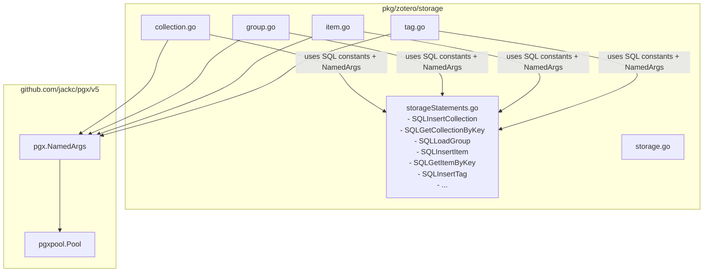

# Requirements

### Overview & Goals
Refactor the database layer in `pkg/zotero/storage` according to the architecture pattern established in `mediaserverpg/pkg/service/apiStatements.go`:
1. **Remove Schema Prefix from SQL Queries**: Since PostgreSQL connection strings (DSN) define a default schema path (e.g., `search_path=main` or `search_path=public`), hardcoded/interpolated `%s.` schema prefixes in SQL queries are redundant and can be removed.
2. **Centralize SQL Queries in a Single File**: Consolidate all SQL query strings scattered across `collection.go`, `group.go`, `item.go`, and `tag.go` into a single dedicated file: `pkg/zotero/storage/storageStatements.go`.
3. **Adopt Named Parameters (`pgx.NamedArgs`)**: Switch from positional placeholders (`$1`, `$2`, ...) and `fmt.Sprintf` query construction to explicit `@param` placeholders with `pgx.NamedArgs{...}`.

### Scope
- **In Scope**:
  - Creating `pkg/zotero/storage/storageStatements.go` containing all SQL query constants with `@param` named parameters and no schema prefixes.
  - Refactoring `pkg/zotero/storage/collection.go`, `group.go`, `item.go`, and `tag.go` to use statement constants and `pgx.NamedArgs`.
  - Replacing dynamic `IN ($1, $2, ...)` parameter string builders with PostgreSQL array matching (`key = ANY(@keys)`).
  - Updating unit tests and mock tests in `pkg/zotero/storage` to ensure all tests pass.
  - Verifying the entire workspace builds (`go build ./...`) and tests (`go test ./...`) cleanly.
- **Out of Scope**:
  - Modifying database schemas or table definitions in PostgreSQL.
  - Altering business logic, sync semantics, or external public interfaces of `Storage` (`*model.Item`, `*model.Collection`, etc.).

### User Stories
- **As a Developer**, I want all SQL statements centralized in `storageStatements.go` with named arguments (`@param`) and schema-agnostic table references so that queries are maintainable, readable, type-safe, and consistent with `mediaserverpg`.

### Functional Requirements
- **FR-1**: All SQL queries in `pkg/zotero/storage` must be declared as exported `const` strings in `pkg/zotero/storage/storageStatements.go`.
- **FR-2**: All SQL queries must reference tables and materialized views directly without schema qualification (e.g. `collections`, `items`, `groups`, `syncgroups`, `tags`, `collection_name_hier`, `item_type_hier`, `refresh_item_type_hier()`).
- **FR-3**: All parameterized queries must use `@parameterName` placeholders and pass parameters via `pgx.NamedArgs`.
- **FR-4**: Slices for multi-key lookups (`GetCollections`, `GetItems`) must utilize `key = ANY(@keys)` instead of dynamically building comma-separated `$1, $2` lists.
- **FR-5**: Storage methods must retain their existing behavior, error handling (`IsEmptyResult`, `IsUniqueViolation`), and return signatures.

### Non-Functional Requirements
- **Readability & Maintainability**: Queries are defined once as static constants, eliminating runtime string formatting with `fmt.Sprintf`.
- **Safety**: Named parameters prevent index mismatch bugs and improve query readability.
- **Backward Compatibility**: `Storage` struct and constructor signatures continue to work seamlessly with existing callers across `cmd/`.

# Technical Design

### Current Implementation
- SQL queries in `pkg/zotero/storage/collection.go`, `group.go`, `item.go`, and `tag.go` are generated dynamically at runtime using `fmt.Sprintf("... %s.tableName ...", s.dbSchema)`.
- Query parameters use positional placeholders (`$1, $2, $3, ...`), requiring index-aligned parameter slices `[]any{...}`.
- Multi-key queries (`GetCollections`, `GetItems`) dynamically build string slices of `$N` placeholders (`strings.Join(pstr, ",")`).

### Key Decisions
- **Reference Pattern from `mediaserverpg`**: Model `pkg/zotero/storage/storageStatements.go` directly after `mediaserverpg/pkg/service/apiStatements.go`.
- **Schema-Agnostic Table Names**: Remove `%s.` prefix from all SQL statements. The active search path is determined by the connection DSN (`search_path=...`) or the default database schema.
- **`pgx.NamedArgs` for Parameterization**: Use `@param` in SQL query constants and pass `pgx.NamedArgs{"param": value}` to `db.Exec`, `db.Query`, and `db.QueryRow`.
- **PostgreSQL `ANY(@keys)` for Slices**: Replace dynamic `IN ($1, $2, ...)` queries with `key = ANY(@keys)` which pgx v5 handles natively with Go string slices `[]string`.

### Architecture Diagram


### Proposed File Structure
- `pkg/zotero/storage/storageStatements.go` (NEW):
  - Declares all SQL query constants with `@param` placeholders.
- `pkg/zotero/storage/collection.go` (MODIFIED):
  - Uses `storageStatements.go` constants and `pgx.NamedArgs`.
- `pkg/zotero/storage/group.go` (MODIFIED):
  - Uses `storageStatements.go` constants and `pgx.NamedArgs`.
- `pkg/zotero/storage/item.go` (MODIFIED):
  - Uses `storageStatements.go` constants and `pgx.NamedArgs`.
- `pkg/zotero/storage/tag.go` (MODIFIED):
  - Uses `storageStatements.go` constants and `pgx.NamedArgs`.
- `pkg/zotero/storage/storage_mock_test.go` & `storage_test_helpers_test.go` (MODIFIED):
  - Adjusted mock expectations and test fixtures for named arguments and schema-free queries.

### SQL Statements Mapping (`storageStatements.go`)
```go
package storage

const (
    // Collection statements
    SQLInsertCollection = `INSERT INTO collections (key, version, library, sync, data, deleted) VALUES (@key, @version, @library, @sync, @data, false)`
    SQLRefreshCollectionNameHier = `REFRESH MATERIALIZED VIEW collection_name_hier WITH DATA`
    SQLInsertEmptyCollection = `INSERT INTO collections (key, version, library, sync) VALUES (@key, 0, @library, @sync)`
    SQLGetCollectionVersion = `SELECT version, sync FROM collections WHERE library = @library AND key = @key`
    SQLGetCollections = `SELECT key, version, data, meta, deleted, sync, gitlab FROM collections WHERE library = @library AND key = ANY(@keys)`
    SQLGetCollectionVersions = `SELECT key, version FROM collections WHERE library = @library AND version > @sinceVersion`
    SQLGetCollectionByKey = `SELECT cs.key, cs.version, cs.data, cs.meta, cs.deleted, cs.sync, cs.gitlab FROM collections cs WHERE cs.library = @library AND cs.key = @key`
    SQLGetCollectionByName = `SELECT cs.key, cs.version, cs.data, cs.meta, cs.deleted, cs.sync, cs.gitlab FROM collections cs WHERE cs.library = @library AND cs.data->>'name' = @name AND cs.deleted = false`
    SQLGetChildCollections = `SELECT cs.key, cs.version, cs.data, cs.meta, cs.deleted, cs.sync, cs.gitlab FROM collections cs WHERE cs.library = @library AND cs.data->>'parentCollection' = @parentKey AND cs.deleted = false`
    SQLGetChildCollectionsDirect = `SELECT cs.key, cs.version, cs.data, cs.meta, cs.deleted, cs.sync, cs.gitlab FROM collections cs WHERE cs.library = @library AND cs.data->>'parentCollection' = @parentKey`
    SQLGetChildCollectionsDirectTop = `SELECT cs.key, cs.version, cs.data, cs.meta, cs.deleted, cs.sync, cs.gitlab FROM collections cs WHERE cs.library = @library AND (cs.data->>'parentCollection' = '' OR cs.data->>'parentCollection' IS NULL OR cs.data->>'parentCollection' = 'false')`
    SQLGetChildCollectionsTop = `SELECT cs.key, cs.version, cs.data, cs.meta, cs.deleted, cs.sync, cs.gitlab FROM collections cs WHERE cs.library = @library AND (cs.data->>'parentCollection' = '' OR cs.data->>'parentCollection' IS NULL OR cs.data->>'parentCollection' = 'false') AND cs.deleted = false`
    SQLUpdateCollection = `UPDATE collections SET version = @version, data = @data, meta = @meta, deleted = @deleted, sync = @sync WHERE library = @library AND key = @key`
    SQLUpdateCollectionGitlabTimestamp = `UPDATE collections SET gitlab = TO_TIMESTAMP(@gitlab, 'YYYY-MM-DD HH24:MI:SS') WHERE library = @library AND key = @key`

    // Group statements
    SQLLoadGroup = `SELECT g.version, g.created, g.modified, g.data, sg.active, sg.direction, sg.tags, g.itemversion, g.collectionversion, g.tagversion, g.gitlab FROM groups g, syncgroups sg WHERE g.id = sg.id AND g.id = @id`
    SQLLoadGroups = `SELECT id FROM syncgroups sg WHERE sg.active = true`
    SQLInsertEmptyGroup = `INSERT INTO groups (id, version, created, modified) VALUES (@id, 0, NOW(), NOW())`
    SQLInsertEmptySyncGroup = `INSERT INTO syncgroups (id, active, direction) VALUES (@id, @active, @direction)`
    SQLGetSyncGroupActiveDirection = `SELECT active, direction FROM syncgroups WHERE id = @id`
    SQLClearGroup = `UPDATE groups SET version = 0, modified = created, itemversion = 0, collectionversion = 0 WHERE id = @id`
    SQLUpdateGroup = `UPDATE groups SET version = @version, created = @created, modified = @modified, data = @data, deleted = @deleted, itemversion = @itemversion, collectionversion = @collectionversion, tagversion = @tagversion WHERE id = @id`
    SQLUpdateGroupGitlabTimestamp = `UPDATE groups SET gitlab = TO_TIMESTAMP(@gitlab, 'YYYY-MM-DD HH24:MI:SS') WHERE id = @id`

    // Item statements
    SQLInsertItem = `INSERT INTO items (key, version, library, sync, data, oldid) VALUES (@key, @version, @library, @sync, @data, @oldid)`
    SQLInsertEmptyItem = `INSERT INTO items (key, version, library, sync) VALUES (@key, 0, @library, @sync)`
    SQLGetItemVersion = `SELECT version, sync FROM items WHERE library = @library AND key = @key`
    SQLGetItemsVersion = `SELECT key, version FROM items WHERE library = @library AND version > @sinceVersion AND trashed = @trashed`
    SQLGetItems = `SELECT key, version, data, meta, trashed, deleted, sync, md5, gitlab FROM items WHERE library = @library AND key = ANY(@keys)`
    SQLGetItemByKey = `SELECT key, version, data, meta, trashed, deleted, sync, md5, gitlab FROM items WHERE library = @library AND key = @key`
    SQLGetItemByOldid = `SELECT key, version, data, meta, trashed, deleted, sync, md5, gitlab FROM items WHERE library = @library AND oldid = @oldid`
    SQLUpdateItem = `UPDATE items SET version = @version, data = @data, meta = @meta, trashed = @trashed, deleted = @deleted, sync = @sync, md5 = @md5, modified = NOW() WHERE library = @library AND key = @key`
    SQLUpdateItemVersion0 = `UPDATE items SET data = @data, meta = @meta, trashed = @trashed, deleted = @deleted, sync = @sync, md5 = @md5, modified = NOW() WHERE library = @library AND key = @key`
    SQLDeleteItem = `UPDATE items SET deleted = true, sync = @sync, modified = NOW() WHERE key = @key AND library = @library`
    SQLGetChildren = `SELECT i.key, i.version, i.data, i.meta, i.trashed, i.deleted, i.sync, i.md5, i.gitlab FROM items i, item_type_hier ith WHERE i.trashed = false AND i.deleted = false AND i.key = ith.key AND i.library = ith.library AND i.library = @library AND ith.parent = @parent`
    SQLIterateItemsCount = `SELECT COUNT(*) FROM items WHERE library = @library AND deleted = false`
    SQLIterateItems = `SELECT key, version, data, meta, trashed, deleted, sync, md5, gitlab FROM items WHERE library = @library AND deleted = false`
    SQLIterateItemsAfterCount = `SELECT COUNT(*) FROM items WHERE library = @library AND deleted = false AND (modified > TO_TIMESTAMP(@after, 'YYYY-MM-DD HH24:MI:SS'))`
    SQLIterateItemsAfter = `SELECT key, version, data, meta, trashed, deleted, sync, md5, gitlab FROM items WHERE library = @library AND deleted = false AND (modified > TO_TIMESTAMP(@after, 'YYYY-MM-DD HH24:MI:SS'))`
    SQLIterateItemsAllCount = `SELECT COUNT(*) FROM items WHERE library = @library`
    SQLIterateItemsAll = `SELECT key, version, data, meta, trashed, deleted, sync, md5, gitlab FROM items WHERE library = @library`
    SQLIterateItemsAllAfterCount = `SELECT COUNT(*) FROM items WHERE library = @library AND (modified > TO_TIMESTAMP(@after, 'YYYY-MM-DD HH24:MI:SS'))`
    SQLIterateItemsAllAfter = `SELECT key, version, data, meta, trashed, deleted, sync, md5, gitlab FROM items WHERE library = @library AND (modified > TO_TIMESTAMP(@after, 'YYYY-MM-DD HH24:MI:SS'))`
    SQLGetModifiedItems = `SELECT key, version, data, meta, trashed, deleted, sync, md5, gitlab FROM items WHERE library = @library AND (sync = @syncNew OR sync = @syncModified)`
    SQLRefreshItemTypeHier = `SELECT refresh_item_type_hier()`
    SQLUpdateItemsGitlabTimestamp = `UPDATE items SET gitlab = TO_TIMESTAMP(@now, 'YYYY-MM-DD HH24:MI:SS') WHERE library = @library AND (TO_TIMESTAMP(@now, 'YYYY-MM-DD HH24:MI:SS') > gitlab OR gitlab IS NULL)`
    SQLUpdateItemsGitlabTimestampWithFilter = `UPDATE items SET gitlab = TO_TIMESTAMP(@now, 'YYYY-MM-DD HH24:MI:SS') WHERE library = @library AND (TO_TIMESTAMP(@now, 'YYYY-MM-DD HH24:MI:SS') > gitlab OR gitlab IS NULL) AND (gitlab >= TO_TIMESTAMP(@gitlab, 'YYYY-MM-DD HH24:MI:SS') OR gitlab IS NULL)`

    // Tag statements
    SQLInsertTag = `INSERT INTO tags (tag, meta, library) VALUES (@tag, @meta, @library)`
    SQLDeleteTag = `DELETE FROM tags WHERE tag = @tag AND library = @library`
)
```

### Risks & Mitigations
- **pgx NamedArgs internal parsing in mock tests**: `pgx` parses `@param` into positional `$1, $2, ...` in alphabetical or occurrence order. Mock tests with wire protocol scripts will be checked and aligned so tests accurately reflect parameter mapping.
- **Nil / Null value serialization**: `sql.NullString` and `*string` values in `pgx.NamedArgs` will be passed directly, preserving exact SQL NULL handling.

# Testing

### Validation Approach
Verification will be performed at three levels:
1. **Unit & Mock Tests**: Execute mock tests in `pkg/zotero/storage` to verify wire protocol behavior and result mappings.
2. **Integration Tests**: Execute integration test suite in `pkg/zotero/storage` against PostgreSQL if a live database is available.
3. **Workspace Verification**: Compile and run all tests across the repository to verify zero regressions.

### Key Scenarios
- **Collection Operations**: Creating collections, retrieving by key/name/hierarchy, updating, and fetching multiple collections via `ANY(@keys)`.
- **Group Operations**: Loading group, loading all active groups, creating empty group with unique violation fallback, and updating group metadata.
- **Item Operations**: Creating items, updating item with version > 0 and version == 0, fetching child items, iterating items with timestamps, and batch updating gitlab timestamps.
- **Tag Operations**: Creating tag with duplicate constraint tolerance and deleting tags.

### Test Commands
```powershell

# Run storage tests

go test -v ./pkg/zotero/storage/

# Run full project tests

go test ./pkg/...

# Build all binaries in workspace

go build ./...
```

# Delivery Steps

### ✓ Step 1: Create storageStatements.go with centralized SQL constants and named parameters
`pkg/zotero/storage/storageStatements.go` is created containing all SQL query constants without schema prefixes and using `@param` named placeholders.

- Create `pkg/zotero/storage/storageStatements.go` in `package storage`.
- Define constants for all collection operations (`SQLInsertCollection`, `SQLRefreshCollectionNameHier`, `SQLInsertEmptyCollection`, `SQLGetCollectionVersion`, `SQLGetCollections`, `SQLGetCollectionVersions`, `SQLGetCollectionByKey`, `SQLGetCollectionByName`, `SQLGetChildCollections`, `SQLGetChildCollectionsDirect`, `SQLGetChildCollectionsDirectTop`, `SQLGetChildCollectionsTop`, `SQLUpdateCollection`, `SQLUpdateCollectionGitlabTimestamp`).
- Define constants for all group operations (`SQLLoadGroup`, `SQLLoadGroups`, `SQLInsertEmptyGroup`, `SQLInsertEmptySyncGroup`, `SQLGetSyncGroupActiveDirection`, `SQLClearGroup`, `SQLUpdateGroup`, `SQLUpdateGroupGitlabTimestamp`).
- Define constants for all item operations (`SQLInsertItem`, `SQLInsertEmptyItem`, `SQLGetItemVersion`, `SQLGetItemsVersion`, `SQLGetItems`, `SQLGetItemByKey`, `SQLGetItemByOldid`, `SQLUpdateItem`, `SQLUpdateItemVersion0`, `SQLDeleteItem`, `SQLGetChildren`, `SQLIterateItemsCount`, `SQLIterateItems`, `SQLIterateItemsAfterCount`, `SQLIterateItemsAfter`, `SQLIterateItemsAllCount`, `SQLIterateItemsAll`, `SQLIterateItemsAllAfterCount`, `SQLIterateItemsAllAfter`, `SQLGetModifiedItems`, `SQLRefreshItemTypeHier`, `SQLUpdateItemsGitlabTimestamp`, `SQLUpdateItemsGitlabTimestampWithFilter`).
- Define constants for all tag operations (`SQLInsertTag`, `SQLDeleteTag`).
- Remove all `%s.` schema prefixes and replace `$1, $2, ...` positional parameters with self-documenting `@param` placeholders.

### ✓ Step 2: Refactor collection.go and tag.go to use SQL constants and pgx.NamedArgs
`collection.go` and `tag.go` are refactored to execute centralized query constants using `pgx.NamedArgs`.

- In `pkg/zotero/storage/collection.go`, replace dynamic `fmt.Sprintf` query formatting with statement constants from `storageStatements.go`.
- Convert all query arguments in `CreateCollection`, `CreateEmptyCollection`, `GetCollectionVersion`, `GetCollections`, `GetCollectionVersions`, `GetCollectionByKey`, `GetCollectionByName`, `GetChildCollections`, `GetChildCollectionsDirect`, `GetChildCollectionsTop`, `UpdateCollection`, `UpdateCollectionGitlabTimestamp` to `pgx.NamedArgs`.
- Update array-matching in `GetCollections` to use `key = ANY(@keys)` with slice argument instead of building dynamic `$1, $2...` SQL strings.
- In `pkg/zotero/storage/tag.go`, refactor `CreateTag` and `DeleteTag` to use `SQLInsertTag` and `SQLDeleteTag` with `pgx.NamedArgs`.

### ✓ Step 3: Refactor group.go and item.go to use SQL constants and pgx.NamedArgs
`group.go` and `item.go` are refactored to execute centralized query constants using `pgx.NamedArgs`.

- In `pkg/zotero/storage/group.go`, replace dynamic `fmt.Sprintf` queries in `LoadGroup`, `LoadGroups`, `CreateEmptyGroup`, `ClearGroup`, `UpdateGroup`, and `UpdateGroupGitlabTimestamp` with `storageStatements.go` constants and `pgx.NamedArgs`.
- In `pkg/zotero/storage/item.go`, replace dynamic `fmt.Sprintf` queries in `CreateItem`, `CreateEmptyItem`, `GetItemVersion`, `GetItemsVersion`, `GetItems`, `GetItemByKey`, `GetItemByOldid`, `UpdateItem`, `DeleteItem`, `GetChildren`, `IterateItems`, `IterateItemsAll`, `GetModifiedItems`, `RefreshItemTypeHier`, and `UpdateItemsGitlabTimestamp` with `storageStatements.go` constants and `pgx.NamedArgs`.
- Update array-matching in `GetItems` to use `key = ANY(@keys)` with slice argument.

### * Step 4: Update test suite and verify project build and test execution
All storage unit, mock, and integration tests pass, and the entire workspace compiles cleanly.

- Update mock and helper test expectations in `pkg/zotero/storage/storage_mock_test.go`, `storage_test.go`, and `storage_test_helpers_test.go` to match the schema-free query execution and named argument parameter order.
- Run `go test -v ./pkg/zotero/storage/...` to verify all unit, mock, and helper tests pass.
- Run `go test ./pkg/...` and `go build ./...` across the entire project repository to ensure no regressions.