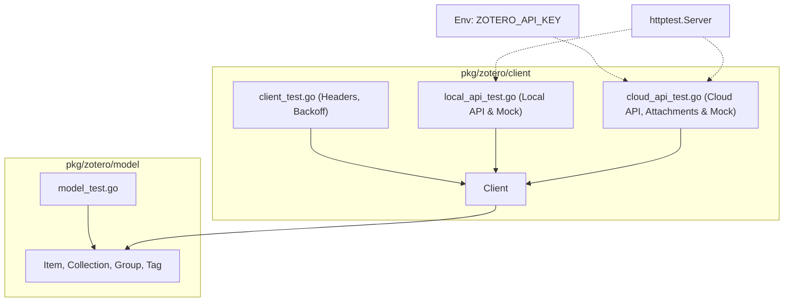

# Requirements

### Overview & Goals
Im vorherigen Modularisierungs-Task wurde der monolithische Zotero-Code in die Subpackages `pkg/zotero/model`, `pkg/zotero/client`, `pkg/zotero/storage` und `pkg/zotero/sync` aufgeteilt. Dabei wurden die alten monolithischen Testdateien `zotero_test.go`, `zotero_local_api_test.go` und `zotero_cloud_api_test.go` entfernt.

Ziel dieses Plans ist die vollständige Wiederherstellung und saubere Re-Implementierung aller Tests in der neuen modularen Architektur unter `pkg/zotero`:
- **Model-Unit-Tests** (`pkg/zotero/model/model_test.go`): Ergänzung noch fehlender Tests (insb. `TestItemGenericVersionSerialization`).
- **Local API Tests** (`pkg/zotero/client/local_api_test.go`): Re-Implementierung der Pre-Flight-, Lese-, CRUD-, Server-ID- und Mock-Server-Tests angepasst an `client.Client`.
- **Cloud API Tests** (`pkg/zotero/client/cloud_api_test.go`): Re-Implementierung der Cloud-Integrationstests, Mock-Server-, Retry/Backoff- und Attachment-Upload/Download-Tests unter Verwendung des API-Keys aus der Umgebungsvariablen `ZOTERO_API_KEY`.

### Scope
- **In Scope**:
  - Re-Implementierung aller Tests aus den gelöschten Dateien `zotero_test.go`, `zotero_local_api_test.go` und `zotero_cloud_api_test.go`.
  - Auslesen des Zotero-API-Keys aus `os.Getenv("ZOTERO_API_KEY")` (mit Fallback auf den konfigurierten Standardwert).
  - Anpassung aller API-Aufrufe an die neue API von `pkg/zotero/client` und `pkg/zotero/model`.
  - Ausführung von Mock-Tests und Live-Integrationstests gegen die Zotero Cloud- und Local-API.
- **Out of Scope**:
  - Änderungen am Produktivcode von `client`, `model`, `storage` oder `sync`, es sei denn, Tests decken Fehler auf.
  - Änderungen an CLI-Tools (`cmd/*`).

### User Stories
- **Als Entwickler** möchte ich umfassende automatisierte Tests für die Zotero Cloud- und Local-API in der neuen modularen Struktur haben, damit Regressionen beim Refactoring zuverlässig verhindert werden.
- **Als Entwickler** möchte ich, dass der API-Key dynamisch aus `ZOTERO_API_KEY` gelesen wird, damit Tests in lokalen Umgebungen und CI-Pipelines reibungslos laufen.

### Functional Requirements
- Alle Testfunktionen aus `zotero_local_api_test.go` müssen in `pkg/zotero/client/local_api_test.go` verfügbar sein.
- Alle Testfunktionen aus `zotero_cloud_api_test.go` müssen in `pkg/zotero/client/cloud_api_test.go` verfügbar sein.
- `pkg/zotero/model/model_test.go` muss alle Serialisierungs- und Modell-Tests aus dem alten `zotero_test.go` abdecken.
- Mock-Server-Tests müssen ohne externe Netzwerkabhängigkeiten und ohne API-Key erfolgreich durchlaufen.
- Live-API-Tests müssen über `checkCloudZoteroAvailable` bzw. `checkLocalZoteroAvailable` bei Nicht-Erreichbarkeit der Ziel-Endpunkte sauber per `t.Skip` übersprungen werden.

# Technical Design

### Current Implementation
Nach der Modularisierung sind die Funktionen und Datenstrukturen wie folgt aufgeteilt:
- `pkg/zotero/model`: Enthält Typen wie `Item`, `ItemGeneric`, `ItemDataBase`, `Collection`, `CollectionData`, `Group`, `Tag`, `ApiKey`, `LocalAuthResponse`.
- `pkg/zotero/client`: Enthält `Client` mit Methoden wie `GetItemsQuery`, `GetItemByKey`, `GetItemsVersion`, `CreateItems`, `UpdateItem`, `DeleteItem`, `GetCollectionsQuery`, `GetCollectionByKey`, `GetCollectionVersions`, `CreateCollections`, `UpdateCollection`, `DeleteCollection`, `GetTagsVersion`, `GetDeleted`, `GetGroup`, `GetGroups`, `GetUserGroupVersions`, `DetectServerId`, `GetServerId`, `UploadAttachment`, `DownloadAttachment`, `CheckRetry`, `CheckBackoff`.
- `pkg/zotero/storage`: Enthält lokales PostgreSQL-Storage-Repository.
- `pkg/zotero/sync`: Synchronisations-Orchestrator.

### Key Decisions
1. **Verteilung der Testdateien**:
   - Reine Datenmodell- und JSON-Serialisierungstests gehören in `pkg/zotero/model/model_test.go`.
   - Alle API-Client-Tests (sowohl Local API als auch Cloud API und Mock-Server) gehören in das Paket `pkg/zotero/client`:
     - `pkg/zotero/client/client_test.go`: Allgemeine Header-, Rate-Limiting- und Pagination-Unit-Tests.
     - `pkg/zotero/client/local_api_test.go`: Local Zotero API Lese-, Schreib-, Server-ID- und Mock-Tests.
     - `pkg/zotero/client/cloud_api_test.go`: Cloud Zotero API Lese-, Schreib-, Attachment- und Mock-Tests.
2. **API-Key Handling**:
   - `getCloudTestConfig()` liest `ZOTERO_API_KEY` aus `os.Getenv("ZOTERO_API_KEY")`. Ist dieser nicht gesetzt, wird der Standardwert aus `.env` / Testkonfiguration verwendet.
3. **Anpassung an neue Methodensignaturen**:
   - Methoden werden direkt auf `*client.Client` aufgerufen (z. B. `c.GetGroup(groupId)`, `c.CreateItems(groupId, items, &lastModVer)`).
   - Datentypen stammen aus `model` (z. B. `model.ItemGeneric`, `model.CollectionData`).

### Architecture Diagram

### Components & File Structure
- `pkg/zotero/model/model_test.go`:
  - `TestItemGenericVersionSerialization` ergänzen.
- `pkg/zotero/client/local_api_test.go`:
  - `getLocalTestConfig()`, `checkLocalZoteroAvailable()`, `getTestClient()`
  - Live Tests: `TestLocalApi_PreFlightAndClientInit`, `TestLocalApi_ReadAPITESTGroup`, `TestLocalApi_ReadAPITESTItems`, `TestLocalApi_ReadAPITESTCollections`, `TestLocalApi_ReadAPITESTTags`, `TestLocalApi_PaginationAndFilters`, `TestLocalApi_CreateAndRetainItems`, `TestLocalApi_CreateAndRetainCollections`, `TestLocalApi_VerifyRetainedData`, `TestLocalApi_ServerIdHeaderExtraction`, `TestLocalApi_UserGroupVersionsWithServerId`
  - Mock Tests: `TestLocalApi_ItemCRUD_MockServerFullCycle`, `TestLocalApi_CollectionCRUD_MockServerFullCycle`, `TestLocalApi_ServerIdHeader_MockServer`
- `pkg/zotero/client/cloud_api_test.go`:
  - `getCloudTestConfig()`, `checkCloudZoteroAvailable()`, `getCloudTestClient()`
  - Live Tests: `TestCloudApi_PreFlightAndClientInit`, `TestCloudApi_ReadAPITESTGroup`, `TestCloudApi_ReadAPITESTItems`, `TestCloudApi_ReadAPITESTCollections`, `TestCloudApi_ReadAPITESTTags`, `TestCloudApi_PaginationAndFilters`, `TestCloudApi_CreateAndRetainItems`, `TestCloudApi_CreateAndRetainCollections`, `TestCloudApi_CreateAndRetainAttachment`, `TestCloudApi_VerifyRetainedData`
  - Mock Tests: `TestCloudApi_MockServerFullCycle`, `TestCloudApi_RetryAfterAndBackoff_MockServer`, `TestCloudApi_AttachmentUploadAndDownload_MockServer`

# Testing

### Validation Approach
Die Tests werden nach der Re-Implementierung sukzessive und automatisiert ausgeführt:
1. **Model-Tests**: `go test -v ./pkg/zotero/model/...`
2. **Client-Mock- und Unit-Tests**: `go test -v -run "Mock|Header|Retry|Backoff" ./pkg/zotero/client/...`
3. **Local API Tests**: `go test -v -run "TestLocalApi_" ./pkg/zotero/client/...` (wird bei inaktivem lokalem Zotero geskippt).
4. **Cloud API Tests**: `go test -v -run "TestCloudApi_" ./pkg/zotero/client/...` (nutzt `ZOTERO_API_KEY`).
5. **Gesamtrepository**: `go test ./...`

### Key Scenarios
- **Model JSON-Serialisierung**: `ItemGeneric` und `CollectionData` lassen `key` und `version` bei Neuerstellung weg und behalten sie beim Update bei.
- **Mock Server Full Cycle**: Vollständiger Zyklus von Erstellung, Abfrage, Aktualisierung und Löschung von Items und Collections via Mock-HTTP-Server.
- **Rate-Limiting & Backoff**: Mock-Server antwortet mit 429 Retry-After und Backoff-Headern; Client führt Retries und Backoff-Pausen korrekt durch.
- **Attachment 3-Schritt-Upload**: Mock- und Live-Tests verifizieren Upload-Autorisierung, Storage-Upload mit Prefix/Suffix, Registrierung und binären Download mit MD5-Abgleich.
- **Graceful Skip**: Wenn Zotero Cloud oder Local API nicht erreichbar oder unautorisiert sind, schlagen Tests nicht fehl, sondern skippen sauber.

### Edge Cases
- Ungültige oder fehlende `ZOTERO_API_KEY`-Umgebungsvariable.
- HTTP 412 Precondition Failed / Version Mismatch Handling.
- `"exists": 1` Antwort bei Attachment-Uploads.

# Delivery Steps

### ✓ Step 1: Re-integrate missing model serialization tests in pkg/zotero/model
Re-integrate missing serialization unit tests for `ItemGeneric` into the `model` package.

- Add `TestItemGenericVersionSerialization` in `pkg/zotero/model/model_test.go` to verify key and version omission when zero/empty and retention on existing items.
- Ensure all model serialization, creator mapping, relation parsing, and metadata conversion tests pass via `go test ./pkg/zotero/model/...`.

### ✓ Step 2: Implement Local Zotero API test suite in pkg/zotero/client
Implement the local Zotero API test suite targeting `pkg/zotero/client` and `pkg/zotero/model`.

- Create `pkg/zotero/client/local_api_test.go` with configuration helpers (`getLocalTestConfig`, `checkLocalZoteroAvailable`, `getTestClient`).
- Port live Local API tests: `TestLocalApi_PreFlightAndClientInit`, `TestLocalApi_ReadAPITESTGroup`, `TestLocalApi_ReadAPITESTItems`, `TestLocalApi_ReadAPITESTCollections`, `TestLocalApi_ReadAPITESTTags`, `TestLocalApi_PaginationAndFilters`, `TestLocalApi_CreateAndRetainItems`, `TestLocalApi_CreateAndRetainCollections`, `TestLocalApi_VerifyRetainedData`, `TestLocalApi_ServerIdHeaderExtraction`, `TestLocalApi_UserGroupVersionsWithServerId`.
- Port Local API mock tests: `TestLocalApi_ItemCRUD_MockServerFullCycle`, `TestLocalApi_CollectionCRUD_MockServerFullCycle`, `TestLocalApi_ServerIdHeader_MockServer`.
- Adapt all calls to use `*client.Client` methods (`GetItemsQuery`, `GetCollectionsQuery`, `GetTagsVersion`, `CreateItems`, `UpdateItem`, `CreateCollections`, `UpdateCollection`, `DeleteItem`, `DeleteCollection`).

### ✓ Step 3: Implement Cloud Zotero API and attachment test suite in pkg/zotero/client
Implement the cloud Zotero API test suite targeting `pkg/zotero/client` with environment variable API key support and attachment workflows.

- Create `pkg/zotero/client/cloud_api_test.go` with configuration helper reading `os.Getenv("ZOTERO_API_KEY")` and default group `APITEST` (`6642571`).
- Port live Cloud API tests: `TestCloudApi_PreFlightAndClientInit`, `TestCloudApi_ReadAPITESTGroup`, `TestCloudApi_ReadAPITESTItems`, `TestCloudApi_ReadAPITESTCollections`, `TestCloudApi_ReadAPITESTTags`, `TestCloudApi_PaginationAndFilters`, `TestCloudApi_CreateAndRetainItems`, `TestCloudApi_CreateAndRetainCollections`, `TestCloudApi_CreateAndRetainAttachment`, `TestCloudApi_VerifyRetainedData`.
- Port Cloud API mock tests: `TestCloudApi_MockServerFullCycle`, `TestCloudApi_RetryAfterAndBackoff_MockServer`, `TestCloudApi_AttachmentUploadAndDownload_MockServer`.
- Ensure attachment tests use `client.UploadAttachment` and `client.DownloadAttachment` with MD5 integrity verification.

### ✓ Step 4: Validate full test suite execution across all packages
Run all unit, mock, and live test suites across the repository to verify green builds.

- Run `go test -v ./pkg/zotero/model/...` to verify model serialization and data integrity tests.
- Run `go test -v ./pkg/zotero/client/...` with `ZOTERO_API_KEY` to verify mock and live client API tests.
- Run full repository test suite `go test ./...` to guarantee no regressions in other packages (`storage`, `sync`, `cmd/*`, `info`).