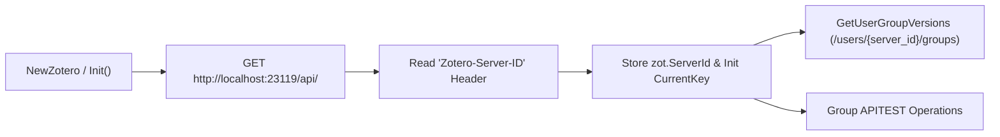

# Requirements

### Overview & Goals
The goal is to update the Zotero client and test suite to properly detect, extract, and use the `Zotero-Server-ID` header when connecting to the local Zotero Web API (`http://localhost:23119/api/`). A lightweight unauthenticated GET request to the local API root reads the `Zotero-Server-ID` response header. The extracted server ID is then stored on the client instance and used for user-scoped API operations (such as `GetUserGroupVersions` and user library endpoints) and verified via integration tests.

### Scope
- **In Scope:**
  - Detecting and extracting the `Zotero-Server-ID` header from initial GET requests to the local Zotero API endpoint (`http://localhost:23119/api/`).
  - Storing `ServerId` (and initializing `CurrentKey` when unauthenticated) on the `Zotero` client instance.
  - Updating `GetUserGroupVersions` to safely handle unauthenticated local mode by utilizing the extracted `ServerId` when `CurrentKey` is nil or has default user ID.
  - Adding integration and unit tests in `pkg/zotero/zotero_local_api_test.go` to verify `Zotero-Server-ID` detection and its application in local service requests.
  - Preserving pre-flight checks, APITEST group scoping, read/write tests, and data retention behavior.

- **Out of Scope:**
  - Modifying cloud authentication logic when a valid `apiKey` is provided.
  - Modifying collections or libraries outside `APITEST` (`6642571`).

### Functional Requirements
- **FR-1:** Probe/query the local API endpoint (e.g. `GET http://localhost:23119/api/`) and read the `Zotero-Server-ID` response header.
- **FR-2:** Store the extracted `ServerId` on `Zotero` client struct and expose helper getter methods (e.g. `GetServerId()`).
- **FR-3:** Automatically initialize or populate `zot.CurrentKey` with `UserId` derived from `ServerId` (or fallback to `0` if absent) when running in unauthenticated mode.
- **FR-4:** Ensure `GetUserGroupVersions` supports unauthenticated local mode without panicking when `key == nil` or when using `ServerId`.
- **FR-5:** Provide automated test coverage in `pkg/zotero/zotero_local_api_test.go` verifying header extraction and server ID usage against both the local Zotero instance and mock endpoints.

# Technical Design

### Current Implementation
- `pkg/zotero/zotero.go`: `Init()` initializes the resty client and sets headers (`Zotero-API-Version: 3`). When `apiKey` is empty, `CurrentKey` remains `nil`.
- `pkg/zotero/user.go`: `GetUserGroupVersions(key *ApiKey)` queries `/users/%v/groups` using `key.UserId`, which panics if `key` is `nil`.
- `cmd/sync/main.go`: Passes `zot.CurrentKey` directly to `zot.GetUserGroupVersions(zot.CurrentKey)`.
- `pkg/zotero/zotero_local_api_test.go`: Tests client initialization, read queries, and retained data creation against group `APITEST`.

### Key Decisions
1. **Header-Based Server ID Discovery:**
   - *Decision:* Perform a lightweight GET request against the API root (`/` or `/api/`) to inspect response headers for `Zotero-Server-ID` (and `X-Zotero-Version` / `Zotero-API-Version`) and store it in `zot.ServerId string`.
   - *Rationale:* Conforms to Zotero local API specifications where the local service announces its server instance identifier (e.g. `ybk07LMXIQat`) in the `Zotero-Server-ID` header without requiring authentication.
2. **Server ID Storage & Local User Fallback:**
   - *Decision:* Store `ServerId` as a string (`zot.ServerId`). For unauthenticated local operation where `apiKey == ""` and `CurrentKey == nil`, initialize `CurrentKey` with `UserId: 0` (local user context) and `Key: ""` so user endpoints (`/users/0/groups`) work without nil-pointer panics or type errors.
   - *Rationale:* `Zotero-Server-ID` is an alphanumeric server identifier, while local Zotero accepts `userID 0` for the active local profile. Initializing `CurrentKey` ensures seamless compatibility with `cmd/sync/main.go` and `GetUserGroupVersions`.
3. **Safe Group Versions Lookup:**
   - *Decision:* Update `GetUserGroupVersions` in `pkg/zotero/user.go` to handle `key == nil` by falling back to `zot.CurrentKey` or user ID `0`.
   - *Rationale:* Ensures robust behavior across both local desktop instances and cloud API endpoints.

### Proposed Changes
- Modify `pkg/zotero/zotero.go`:
  - Add `ServerId string` (and/or `ServerUserId int64`) field to `Zotero` struct.
  - Implement `DetectServerId() (string, error)` or integrate header extraction into `Init()`.
  - Add getter `GetServerId() string`.
- Modify `pkg/zotero/user.go`:
  - Update `GetUserGroupVersions` to fallback to `zot.ServerId` or `zot.CurrentKey` if `key` parameter is nil.
- Modify `pkg/zotero/zotero_local_api_test.go`:
  - Add `TestLocalApi_ServerIdHeaderExtraction` validating that `Zotero-Server-ID` is detected from `http://localhost:23119/api/` or mock responses.
  - Add `TestLocalApi_UserGroupVersionsWithServerId` testing `/users/<server_id>/groups` queries.

### Architecture Diagram


### File Structure
- `pkg/zotero/zotero.go` (Modified): Add server ID detection and storage from `Zotero-Server-ID` header.
- `pkg/zotero/user.go` (Modified): Make `GetUserGroupVersions` nil-safe and server-ID aware.
- `pkg/zotero/zotero_local_api_test.go` (Modified): Add integration tests for server ID extraction and user-scoped queries.

# Testing

### Validation Approach
Verification is performed with `go test` against the running local Zotero instance (`http://localhost:23119/api/`) and mock HTTP servers.

### Key Scenarios
1. **Server ID Header Detection:**
   - Execute `GET /api/` against local Zotero and verify header inspection captures `Zotero-Server-ID` if present.
   - Verify `zot.GetServerId()` returns the expected value.
2. **Unauthenticated CurrentKey Population:**
   - Confirm `zot.CurrentKey` is initialized with the detected server ID (or local fallback).
3. **User Group Versions Query:**
   - Call `GetUserGroupVersions` without credentials; verify successful query against `/users/{server_id}/groups` (or `/users/0/groups`).
4. **Mock Server Header Extraction:**
   - Test mock server returning `Zotero-Server-ID: 3354739` and assert client correctly extracts and applies the ID.

### Test Execution Commands
```powershell

# Run local API integration tests

go test -v -run TestLocalApi ./pkg/zotero/...

# Run all unit and integration tests

go test -v ./pkg/zotero/...
```

# Delivery Steps

### ✓ Step 1: Implement Server ID Detection and Client State in pkg/zotero
The Zotero client extracts `Zotero-Server-ID` from local API responses and stores the server ID for unauthenticated operation.

- Add `ServerId` field and `GetServerId()` accessor to `Zotero` struct in `pkg/zotero/zotero.go`.
- Implement `DetectServerId()` / enhance `Init()` to send a GET request to `baseUrl` and parse the `Zotero-Server-ID` response header.
- Populate `zot.CurrentKey` with local user info derived from `ServerId` when running unauthenticated.

### ✓ Step 2: Update User Group Version Queries for Server ID Support
The user library and group version methods support querying local user endpoints using the detected Server ID.

- Update `GetUserGroupVersions` in `pkg/zotero/user.go` to safely handle nil `key` parameters and use `zot.ServerId` or `key.UserId`.
- Ensure compatibility with both `/users/<server_id>/groups` and `/users/0/groups` endpoints.

### ✓ Step 3: Implement Integration and Unit Tests for Server ID Extraction
The test suite validates Server ID header reading and verifies unauthenticated user-level queries.

- Add `TestLocalApi_ServerIdHeaderExtraction` in `pkg/zotero/zotero_local_api_test.go` to test header reading against local Zotero.
- Add mock server tests validating `Zotero-Server-ID` header parsing and `GetUserGroupVersions` response handling.
- Run `go test -v ./pkg/zotero/...` and verify all tests pass or skip cleanly when offline.