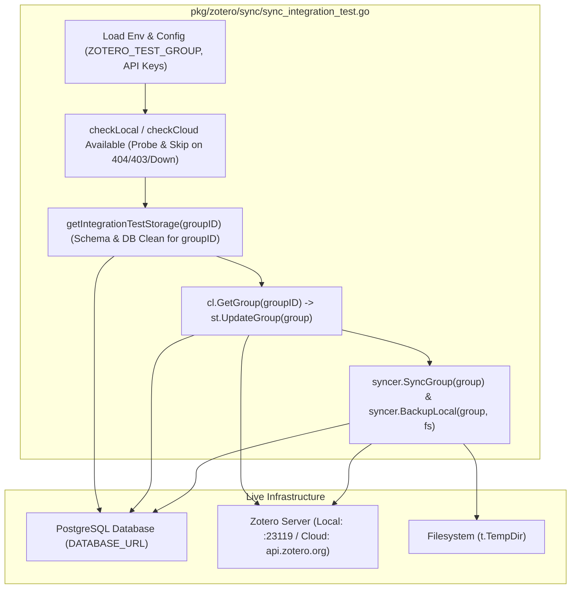

# Requirements

### Overview & Goals
Ziel ist die Bereitstellung und Korrektur einer umfassenden, robusten Testsuite für das Paket `pkg/zotero/sync`. Die Tests decken die Synchronisationslogik (`Syncer`) in zwei Ausprägungen ab:
1. **Mock-Umgebung (Hermetisch & Schnell)**: Vollständige Tests ohne externe Abhängigkeiten unter Verwendung von `pgmock` (PostgreSQL-Protokoll-Mock) und `httptest.Server` (für Zotero Local API und Cloud API).
2. **Server-/Integrationsumgebung (Real Environment)**: Tests mit einer echten PostgreSQL-Datenbank und Anbindung an Zotero Local (Desktop-Client) sowie Zotero Cloud (`api.zotero.org`), inklusive Graceful Skipping bei fehlender Testinfrastruktur oder fehlenden Berechtigungen.

### Scope
- **In Scope**:
  - Behebung von `TestSyncer_Integration_Database_LocalClient` und `TestSyncer_Integration_Database_CloudClient` in `pkg/zotero/sync/sync_integration_test.go`.
  - Korrekte Verwendung der Zotero-Test-Gruppen-ID (`groupID` aus `ZOTERO_TEST_GROUP` bzw. Standard-ID) anstelle einer zufälligen synthetischen ID, damit Live-API-Aufrufe an Zotero nicht mit 404/403 fehlschlagen.
  - Abrufen der echten Gruppenmetadaten via `client.GetGroup(groupID)` zur Initialisierung des DB-Zustands vor dem Sync.
  - Isolierte DB-Bereinigung (`DELETE FROM ... WHERE library = groupID`) vor und nach dem Integrationslauf für die jeweilige Gruppen-ID.
  - Robuste Verfügbarkeits- und Berechtigungsprüfungen (`checkLocalZoteroAvailable`, `checkCloudZoteroAvailable`) mit sauberem `t.Skip` bei 401/403/404 oder nicht erreichbaren Endpunkten.
  - Beibehaltung aller hermetischen Mock-Tests in `pkg/zotero/sync/sync_mock_test.go`.
- **Out of Scope**:
  - Änderungen an der produktiven Sync-Logik in `syncer.go`.
  - Externe CI/CD-Runner-Konfigurationen.

### User Stories
- **Als Entwickler** möchte ich `go test ./pkg/zotero/sync/...` offline ausführen können, damit ich Synchronisationsfehler in Local- und Cloud-Szenarien sofort ohne laufende DB oder Cloud-Zugangsdaten erkennen kann.
- **Als Maintainer** möchte ich Integrationstests gegen eine echte PostgreSQL-Datenbank und Zotero-Server ausführen können, um die End-to-End-Konsistenz der Synchronisation gegen echte Zotero-Gruppen abzusichern.

### Functional Requirements
- **FR-1**: Mock-Tests in `sync_mock_test.go` müssen weiterhin unabhängig und ohne externe Abhängigkeiten erfolgreich durchlaufen.
- **FR-2**: In `sync_integration_test.go` müssen `TestSyncer_Integration_Database_LocalClient` und `TestSyncer_Integration_Database_CloudClient` die konfigurierte Zotero-Gruppen-ID (`groupID`) verwenden und Gruppen-Metadaten via Zotero-Client abrufen.
- **FR-3**: `getIntegrationTestStorage` muss die Ziel-Gruppen-ID entgegennehmen und die DB vor und nach dem Test gezielt für diese Gruppen-ID bereinigen.
- **FR-4**: Fehlt die Datenbank (`DATABASE_URL`), der Zotero-Endpunkt oder sind Zugangsdaten / Gruppen ungültig (401/403/404/Timeout), müssen die Tests mit `t.Skip` sauber übersprungen werden.
- **FR-5**: Nach erfolgreichem `SyncGroup` muss auch `BackupLocal` das Schreiben von JSON- und Binärdateien im Dateisystem überprüfen.

### Non-Functional Requirements
- **Determinismus & Isolation**: Saubere Isolation der Testdaten in der PostgreSQL-Datenbank ohne Kollisionen.
- **Fehlertoleranz**: Aussagekräftige Skip- und Fehlermeldungen bei fehlender oder unvollständiger Testumgebung.

# Technical Design

### Current Implementation & Root Cause Analysis
In `pkg/zotero/sync/sync_integration_test.go` wurden Integrationstests für `Syncer` gegen PostgreSQL und Zotero-Clients eingeführt. Diese schlugen in Live-Umgebungen aus folgenden Gründen fehl:
1. **Gruppen-ID Mismatch**: `getIntegrationTestStorage` erzeugte eine zufällige ID `testGroupID := int64(77770000 + ...)`. Diese Dummy-ID wurde in `group.Id` gesetzt. Beim Aufruf von `syncer.SyncGroup(group)` fragte der Zotero-Client `/groups/7777xxxx/...` an. Da diese Gruppe auf dem Zotero-Server/Desktop nicht existiert, antwortete Zotero mit `404 Not Found` bzw. `403 Forbidden`.
2. **Fehlende Gruppen-Metadaten**: Statt die Zotero-Gruppe via `client.GetGroup(groupID)` abzufragen, wurde ein statisches Gruppen-Objekt mit Version 0 initialisiert, ohne die tatsächlichen Versionsstände und Gruppeneigenschaften zu berücksichtigen.
3. **Verbindungs- und Berechtigungsprüfung**: `checkLocalZoteroAvailable` und `checkCloudZoteroAvailable` prüften nicht alle HTTP-Fehlercodes (z.B. 401 Unauthorized, 404 Group Not Found) und übersprangen Tests bei fehlender Gruppenberechtigung nicht konsistent mit `t.Skip`.

### Key Decisions
1. **Verwendung der konfigurierten Zotero Test Group ID**:
   - `getLocalTestConfig()` und `getCloudTestConfig()` lesen `ZOTERO_TEST_GROUP` (Default: `6642571`).
   - Diese `groupID` wird für alle Zotero-API-Aufrufe, Datenbank-Einträge und Bereinigungen verwendet.
2. **Gruppenbezogene DB-Initialisierung und Isolation**:
   - `getIntegrationTestStorage(t, groupID)` bereinigt die Tabellen `tags`, `items`, `collections`, `syncgroups` und `groups` für `groupID` vor dem Testlauf und im `defer cleanupDB()`.
   - `cl.GetGroup(groupID)` liest die Gruppe vom Zotero-Server; falls nicht gefunden oder Fehler, überspringt der Test mit `t.Skipf`.
3. **Erweiterte Availability- & Auth-Prüfungen**:
   - `checkLocalZoteroAvailable`: Prüft `/groups/{groupID}`. Bei 404/401/403/503/Connection-Error -> `t.Skipf`.
   - `checkCloudZoteroAvailable`: Prüft `/groups/{groupID}/items?limit=1` mit `Zotero-API-Key`. Bei 401/403/404/Connection-Error -> `t.Skipf`.

### Architecture Diagram

### Proposed Changes & File Structure
- **`pkg/zotero/sync/sync_integration_test.go`** (Anpassung):
  - Signatur von `getIntegrationTestStorage(t *testing.T, groupID int64)` anpassen; sauberes Pre- und Post-Cleanup für `groupID`.
  - `checkLocalZoteroAvailable` und `checkCloudZoteroAvailable` robuster gestalten (Skip bei 404, 401, 403, 5xx, Verbindungsausfall).
  - In `TestSyncer_Integration_Database_LocalClient`: `groupID` aus `getLocalTestConfig()` verwenden, `cl.GetGroup(groupID)` abfragen, `group.Direction = model.SyncDirection_BothLocal` setzen und `syncer.SyncGroup` + `BackupLocal` ausführen.
  - In `TestSyncer_Integration_Database_CloudClient`: `groupID` aus `getCloudTestConfig()` verwenden, `cl.GetGroup(groupID)` abfragen, `group.Direction = model.SyncDirection_BothCloud` setzen und `syncer.SyncGroup` + `BackupLocal` ausführen.

# Testing

### Validation Approach
Die Überprüfung der Tests erfolgt über standardmäßige Go-Test-Tools und separate Test-Läufe für isolierte Mock-Tests und umgebungsabhängige Integrationstests.

### Key Scenarios
1. **Mock Local Client + Mock DB**:
   - Zotero-Server-ID Header wird vom Client erkannt.
   - Lokale Sammlungen und Items werden aus der Mock-DB gelesen und via Mock-Client abgeglichen.
   - Aktualisierte Versionen werden in `groups` gespeichert.
2. **Mock Cloud Client + Mock DB**:
   - Items mit Anhängen (`imported_file`) werden heruntergeladen und im Dateisystem abgelegt.
   - Modifizierte Items werden zum Cloud-Mock hochgeladen.
3. **BackupLocal Test**:
   - `BackupLocal` iteriert Collections und Items und schreibt gültige JSON-Dateien sowie `.bin` Binärdateien im Temp-Verzeichnis.
4. **Real Database + Live/Mock Server**:
   - Bei gesetztem `DATABASE_URL` wird eine echte Transaktion ausgeführt, Datensätze in PostgreSQL persistiert und die Konsistenz validiert.
   - Bei nicht gesetzter Umgebung wird der Test via `t.Skip` sauber übersprungen.

### Edge Cases
- Leere Sammlungen oder keine modifizierten Einträge.
- Unsynchronisierter Status / Konflikte (`SyncStatus_Conflict` -> Abbruch mit Fehlermeldung).
- Fehlendes Dateisystem (`s.Fs == nil`) oder nicht erreichbare Attachment-Buckets.
- Netzwerkfehler / Timeout-Simulationen im Mock-Server.

# Delivery Steps

### ✓ Step 1: Bereinigungs- und Gruppen-ID-Handling in `sync_integration_test.go` korrigieren
`getIntegrationTestStorage` nimmt die Ziel-Gruppen-ID entgegen und isoliert die DB-Daten für den jeweiligen Testlauf.

- Signatur von `getIntegrationTestStorage(t *testing.T, groupID int64)` anpassen.
- Pre-Test Cleanup und Defer Cleanup für `tags`, `items`, `collections`, `syncgroups` und `groups` auf `groupID` ausrichten.
- Übergabe der echten `groupID` aus `getLocalTestConfig()` und `getCloudTestConfig()`.

### ✓ Step 2: Verfügbarkeits- und Gruppenabruf-Logik für Local- und Cloud-Tests anbinden
`TestSyncer_Integration_Database_LocalClient` und `TestSyncer_Integration_Database_CloudClient` rufen die Zotero-Gruppe via Client ab und überspringen bei fehlenden Rechten/Endpunkten zuverlässig.

- `checkLocalZoteroAvailable` und `checkCloudZoteroAvailable` mit detaillierter HTTP-Statuscode-Auswertung (401, 403, 404, 5xx) und Graceful Skipping versehen.
- In den Testfunktionen `cl.GetGroup(groupID)` aufrufen; bei Nichtverfügbarkeit mit `t.Skipf` überspringen, ansonsten Gruppe für DB initialisieren.
- Ausführung von `syncer.SyncGroup(group)` und anschließendem `syncer.BackupLocal(group, backupFs)` validieren.
- Testausführung via `go test -v ./pkg/zotero/sync/...` und `go test ./...` verifizieren.