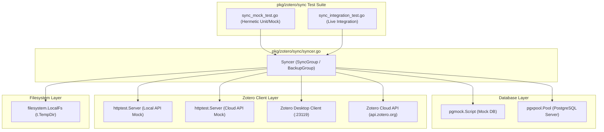

# Requirements

### Overview & Goals
Ziel ist die Bereitstellung einer umfassenden, robusten Testsuite für das Paket `pkg/zotero/sync`. Die Tests sollen die Synchronisationslogik (`Syncer`) in zwei primären Ausprägungen abdecken:
1. **Mock-Umgebung (Hermetisch & Schnell)**: Vollständige Tests ohne externe Abhängigkeiten unter Verwendung von `pgmock` (PostgreSQL-Protokoll-Mock) und `httptest.Server` (für Zotero Local API und Cloud API).
2. **Server-/Integrationsumgebung (Real Environment)**: Tests mit einer echten PostgreSQL-Datenbank und Anbindung an Zotero Local (Desktop-Client) sowie Zotero Cloud (`api.zotero.org`), inklusive Graceful Skipping bei fehlender Testinfrastruktur.

### Scope
- **In Scope**:
  - Unit- und Mock-Tests für `Syncer.SyncGroup`, `SyncCollections`, `UploadItems`, `DownloadItems`, `SyncTags`, `SyncDeleted` und `BackupGroup`.
  - Abdeckung beider Client-Modi: **Local API** (Port 23119, `Zotero-Server-ID`, lokale Authentifizierung) und **Cloud API** (`api.zotero.org`, `Zotero-API-Key`, Cloud-Versioning).
  - Abdeckung beider Datenbank-Modi: **Mock-Datenbank** (`pgmock`) und **echte PostgreSQL-Datenbank** (`pgxpool`).
  - Integration von Dateisystem-Operationen (`filesystem.LocalFs`) für Attachment-Upload/Download und JSON-Backups.
- **Out of Scope**:
  - Änderungen an der produktiven Sync-Logik in `syncer.go`, es sei denn, während der Testerstellung werden funktionale Regressionen aufgedeckt.
  - Externe CI/CD-Runner-Konfigurationen.

### User Stories
- **Als Entwickler** möchte ich `go test ./pkg/zotero/sync/...` offline ausführen können, damit ich Synchronisationsfehler in Local- und Cloud-Szenarien sofort ohne laufende DB oder Cloud-Zugangsdaten erkennen kann.
- **Als Maintainer** möchte ich Integrationstests gegen eine echte PostgreSQL-Datenbank und Zotero-Server ausführen können, um die End-to-End-Konsistenz der Transaktionen, Versionsverwaltung und Dateiablage abzusichern.

### Functional Requirements
- **FR-1**: Mock-Tests für `Syncer` mit `pgmock` und `httptest.Server` (Zotero Local & Cloud) müssen alle Kernmethoden ohne externe Dienste erfolgreich durchlaufen.
- **FR-2**: Synchronisation von Collections, Items (inkl. Attachments), Tags und Löschungen muss für beide Client-Varianten (Local & Cloud) validiert werden.
- **FR-3**: Backup-Logik (`BackupGroup`) muss das Schreiben von JSON-Metadaten und Binär-Dateien im `filesystem.FileSystem` verifizieren.
- **FR-4**: Integrationstests mit echten Servern müssen dynamisch prüfen, ob DB und Zotero-Endpunkte erreichbar sind, und bei fehlenden Konfigurationen sauber mit `t.Skip` überspringen.

### Non-Functional Requirements
- **Determinismus & Isolation**: Mock-Tests müssen unabhängig von Netzwerkverbindungen und parallelisierbar sein.
- **Kompatibilität**: Nahtlose Ausrichtung an bestehenden Testmustern in `pkg/zotero/storage/storage_mock_test.go` und `pkg/zotero/client/local_api_test.go`.

# Technical Design

### Current Implementation
Aktuell enthält `pkg/zotero/sync/sync_test.go` lediglich einen rudimentären Initialisierungstest (`TestSyncerInit`), der nur `NewSyncer` und `GetGroupBucket` aufruft. Die eigentliche Synchronisationslogik (`SyncGroup`, `SyncCollections`, `DownloadItems`, `UploadItems`, `SyncTags`, `SyncDeleted`, `BackupGroup`) in `pkg/zotero/sync/syncer.go` ist noch nicht durch automatisierte Tests abgedeckt.

Im Projekt existieren bereits etablierte Test-Muster:
- `pkg/zotero/storage/storage_mock_test.go`: Verwendet `github.com/jackc/pgmock` und `github.com/jackc/pgproto3/v2` für TCP-basierte PostgreSQL Wire-Protocol Mocks.
- `pkg/zotero/storage/storage_test.go`: Verwendet `DATABASE_URL` / `.env` und `pgxpool.Pool` für Live-Datenbanktests.
- `pkg/zotero/client/local_api_test.go` & `cloud_api_test.go`: Verwenden `httptest.Server` für Mock-Tests und konfigurierbare Endpunkte (`ZOTERO_LOCAL_ENDPOINT`, `ZOTERO_CLOUD_ENDPOINT`, `ZOTERO_API_KEY`) für Live-Integrationstests.

### Key Decisions
1. **Zweiteilung der Testdateien in `pkg/zotero/sync`**:
   - `sync_mock_test.go`: Hermetische Mock-Tests mit `pgmock` und `httptest.Server` (Local & Cloud).
   - `sync_integration_test.go`: Echte Server-Integrationstests mit Live-PostgreSQL-DB und Live-/Simulierten Zotero-Servern.
   *Begründung*: Trennt schnelle Unit-/Mock-Tests von potentiell langsamen oder umgebungsabhängigen Integrationstests.
2. **Kombination von Client-Modi (Local vs. Cloud)**:
   - Parametrisierte oder dedizierte Testfälle für Local-spezifische Eigenschaften (z.B. `Zotero-Server-ID`, UserId 0, Local Key) und Cloud-spezifische Eigenschaften (Group-Rechte, Cloud Key).
3. **Dateisystem-Anbindung**:
   - Verwendung von `filesystem.NewLocalFs(t.TempDir(), ...)` zur Überprüfung von Attachment-Download, Attachment-Upload und `BackupGroup`.

### Architecture Diagram

### Proposed Changes & File Structure
- **`pkg/zotero/sync/sync_mock_test.go`** (Neu):
  - `startMockDatabase(t *testing.T, script *pgmock.Script) (*storage.Storage, func())`: Startet temporären `pgmock`-Server.
  - `startMockZoteroLocalServer(t *testing.T) (*client.Client, func())`: Simuliert lokale Zotero-API.
  - `startMockZoteroCloudServer(t *testing.T) (*client.Client, func())`: Simuliert Zotero-Cloud-API.
  - Testfälle:
    - `TestSyncer_Mock_Local_SyncCollections`: Sync von Collections mit Local Client & Mock DB.
    - `TestSyncer_Mock_Cloud_DownloadAndUploadItems`: Item- & Attachment-Sync mit Cloud Client & Mock DB.
    - `TestSyncer_Mock_SyncTagsAndDeleted`: Tag- und Deletion-Sync.
    - `TestSyncer_Mock_BackupGroup`: Backup-Generierung ins Dateisystem.
- **`pkg/zotero/sync/sync_integration_test.go`** (Neu):
  - `getIntegrationTestSyncer(t *testing.T, isLocal bool) (*Syncer, *model.Group, func())`: Baut Verbindung zu echter DB und konfiguriertem Client auf.
  - Testfälle:
    - `TestSyncer_Integration_Database_LocalClient`: Vollständiger Sync gegen Live-DB und Local-Client.
    - `TestSyncer_Integration_Database_CloudClient`: Vollständiger Sync gegen Live-DB und Cloud-Client.
- **`pkg/zotero/sync/sync_test.go`** (Bestehend):
  - Beibehaltung von `TestSyncerInit` und gemeinsamen Hilfsstrukturen.

# Testing

### Validation Approach
Die Überprüfung der Tests erfolgt über standardmäßige Go-Test-Tools und separate Test-Läufe für isolierte Mock-Tests und umgebungsabhängige Integrationstests.

### Key Scenarios
1. **Mock Local Client + Mock DB**:
   - Zotero-Server-ID Header wird vom Client erkannt.
   - Lokale Sammlungen und Items werden aus der Mock-DB gelesen und via Mock-Client abgeglichen.
   - Aktualisierte Versionen werden in `groups` gespeichert.
2. **Mock Cloud Client + Mock DB**:
   - Items mit Anhängen (`imported_file`) werden heruntergeladen und im Dateisystem abgelegt.
   - Modifizierte Items werden zum Cloud-Mock hochgeladen.
3. **BackupGroup Test**:
   - `BackupGroup` iteriert Collections und Items und schreibt gültige JSON-Dateien sowie `.bin` Binärdateien im Temp-Verzeichnis.
4. **Real Database + Live/Mock Server**:
   - Bei gesetztem `DATABASE_URL` wird eine echte Transaktion ausgeführt, Datensätze in PostgreSQL persistiert und die Konsistenz validiert.
   - Bei nicht gesetzter Umgebung wird der Test via `t.Skip` sauber übersprungen.

### Edge Cases
- Leere Sammlungen oder keine modifizierten Einträge.
- Unsynchronisierter Status / Konflikte (`SyncStatus_Conflict` -> Abbruch mit Fehlermeldung).
- Fehlendes Dateisystem (`s.Fs == nil`) oder nicht erreichbare Attachment-Buckets.
- Netzwerkfehler / Timeout-Simulationen im Mock-Server.

# Delivery Steps

### * Step 1: Mock-basierte Syncer-Tests mit Mock-DB und Mock-Server für Local- und Cloud-Client
Vollständige, isolierte Unit- und Komponententests für `Syncer` in `pkg/zotero/sync` laufen deterministisch und ohne externe Infrastruktur über `pgmock` und `httptest.Server`.

- Mock-Server-Infrastruktur für Zotero Local API (`Zotero-Server-ID`, Local-Key-Header) und Zotero Cloud API (Cloud API Keys, Versioning, Attachment Endpoints) bereitstellen.
- Mock-PostgreSQL-Backend mit `pgmock` und `pgproto3` für `Storage`-Interaktionen konfigurieren (Tabellen `groups`, `collections`, `items`, `tags`, `deleted`, `syncgroups`).
- Testsuite für `Syncer.SyncGroup`, `SyncCollections`, `UploadItems`, `DownloadItems`, `SyncTags`, `SyncDeleted` und `BackupGroup` mit Local- und Cloud-Client-Mock erstellen.
- Lokales Dateisystem (`filesystem.NewLocalFs` mit `t.TempDir()`) für Attachment-Synchronisation und Backup-Generierung einbinden.
- Ausführung und Verifikation via `go test ./pkg/zotero/sync/...` sicherstellen.

###   Step 2: Integrationstests mit echter Datenbank und Live-Zotero-Clients (Local & Cloud)
Live-Integrationstests für `Syncer` gegen eine echte PostgreSQL-Datenbank mit Anbindung an Zotero Local und Cloud APIs sind implementiert und überspringen graceful (`t.Skip`), falls Dienste nicht konfiguriert sind.

- Umgebungs- und Verbindungshandler (`loadEnv`, `getTestStorage`, `checkLocalZoteroAvailable`, `checkCloudZoteroAvailable`) für Integrationstests in `pkg/zotero/sync` aufbauen.
- End-to-End Integrations-Tests für `SyncGroup` mit bidirektionalem Sync (ToLocal, ToRemote, Both) auf einer realen PostgreSQL-Instanz durchführen.
- Testfälle für Zotero Local API (Desktop-Client HTTP-Endpunkt auf `localhost:23119/api`) und Cloud API (`api.zotero.org`) implementieren.
- Überprüfung von Versionserhöhung (`CollectionVersion`, `ItemVersion`, `TagVersion`), Konfliktbehandlung und Attachment-Ablage im Dateisystem.