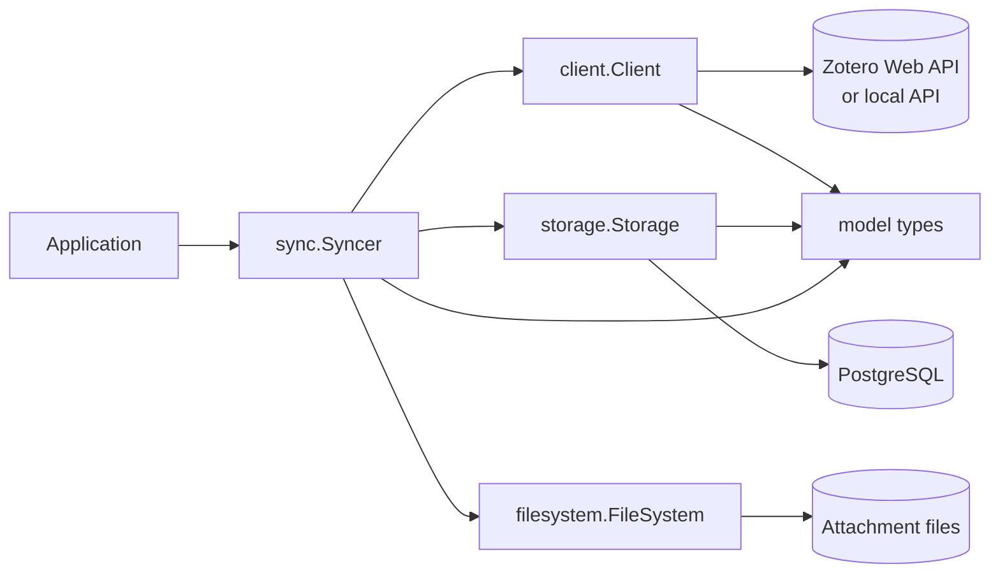

# Zotero integration

The `pkg/zotero` tree implements the Zotero data path used by zsync. It is
split into transport, domain model, persistence, and orchestration packages.

## Package map

| Package | Responsibility |
| --- | --- |
| [`model`](model/README.md) | Zotero API objects, JSON compatibility types, validation, and sync state. |
| [`client`](client/README.md) | HTTP access to the Zotero Web API and local Zotero authorization. |
| [`storage`](storage/README.md) | PostgreSQL persistence and queries for groups, collections, items, and tags. |
| [`sync`](sync/README.md) | Version-based synchronization, attachment transfer, deletion handling, and backups. |

## Architecture

`Syncer` is the application-facing coordinator. The client and storage layers
do not call each other; both exchange `model` values with the coordinator.
This keeps API transport, database representation, and synchronization policy
independently testable.

## Synchronization contract

1. Read the group's stored collection, item, and tag versions.
2. Upload local records marked `new` or `modified` when the direction permits it.
3. Fetch remote version maps and download only newer keys in batches of 50.
4. Store the returned `Last-Modified-Version` values as the next cursors.
5. Apply remote deletions after regular object synchronization.
6. Keep attachment bytes in the configured filesystem; metadata remains in PostgreSQL.

Version preconditions (`If-Unmodified-Since-Version`) protect uploads from
silently overwriting newer remote data.
