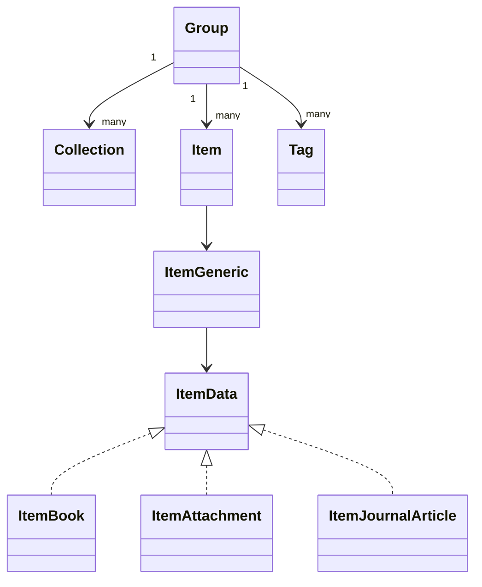

# `model`

The model package is the shared vocabulary between the Zotero API, PostgreSQL
storage, and the synchronizer.

## Object model

`Group` is the synchronization root. A group owns `Collection`, `Item`, and
`Tag` records. `Item` contains an `ItemGeneric` value because Zotero supports
many item types with different fields. Generated typed item structs and
accessors are derived from [`zotero_schema.json`](zotero_schema.json).

## Invariants

- `Key` identifies an object within a library; `Version` is its remote change version.
- `new` and `modified` records are upload candidates.
- `SyncDirection` controls whether a group uploads, downloads, or does both.
- `ItemGeneric` preserves unknown fields while offering typed access to known fields.
- `Validate` checks item type, fields, and creator types against the embedded schema.
- `Relations`, `RelationList`, `ZoteroStringList`, and `ParentCollection` handle
  Zotero's inconsistent empty-value and scalar/list JSON forms.

Run `go generate ./pkg/zotero/model` after changing the schema. Generated files
are `item_types_gen.go` and `item_accessors_gen.go`.
