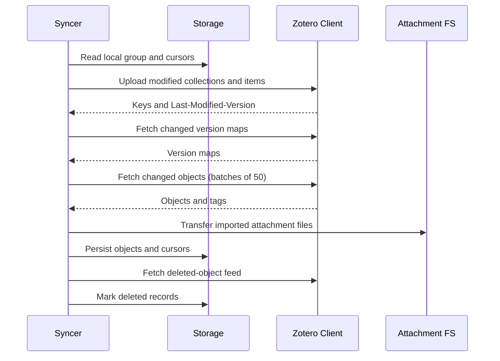

# `sync`

The sync package contains synchronization policy. `Syncer` coordinates one
Zotero `model.Group` through `client.Client`, `storage.Storage`, and an optional
attachment `filesystem.FileSystem`.

## `SyncGroup` pipeline

The public stages are `SyncCollections`, `UploadItems`, `DownloadItems`,
`SyncTags`, and `SyncDeleted`; `SyncGroup` runs them in that order. Stages are
skipped according to `Group.Direction`, and tags require `Group.SyncTags`.

`BackupLocal` writes group, collection, and item JSON below a group directory.
Imported attachment bytes are written as `<item-key>.bin`; backup timestamps
are stored in PostgreSQL for incremental backups.

Uploads use Zotero version preconditions. A failed precondition indicates that
the remote object changed and must not be overwritten blindly.
